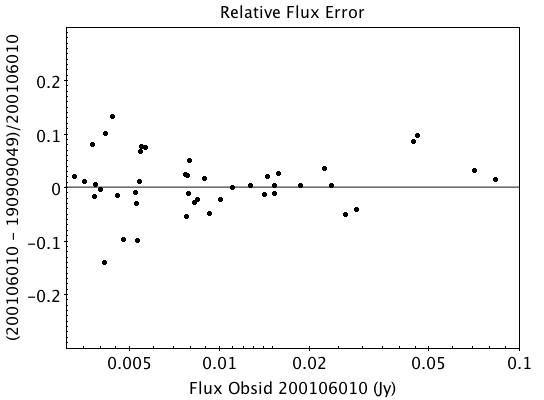
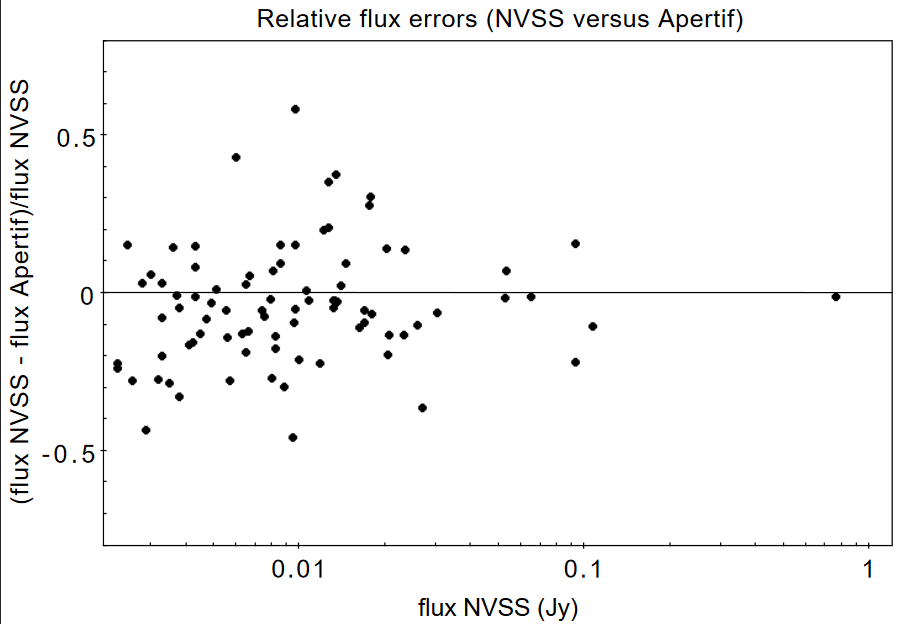
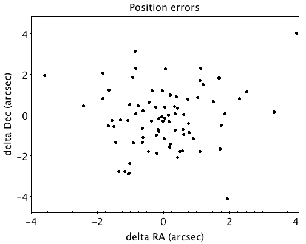
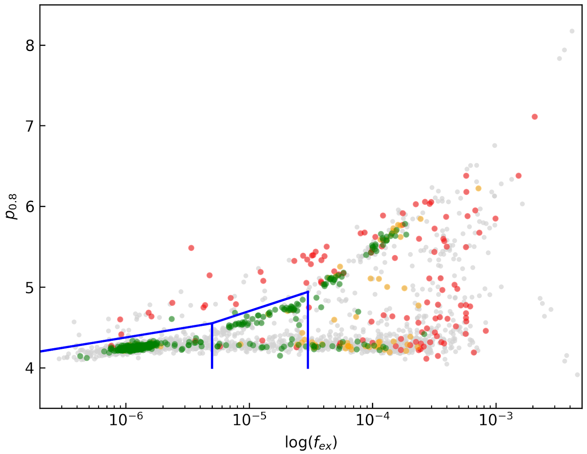
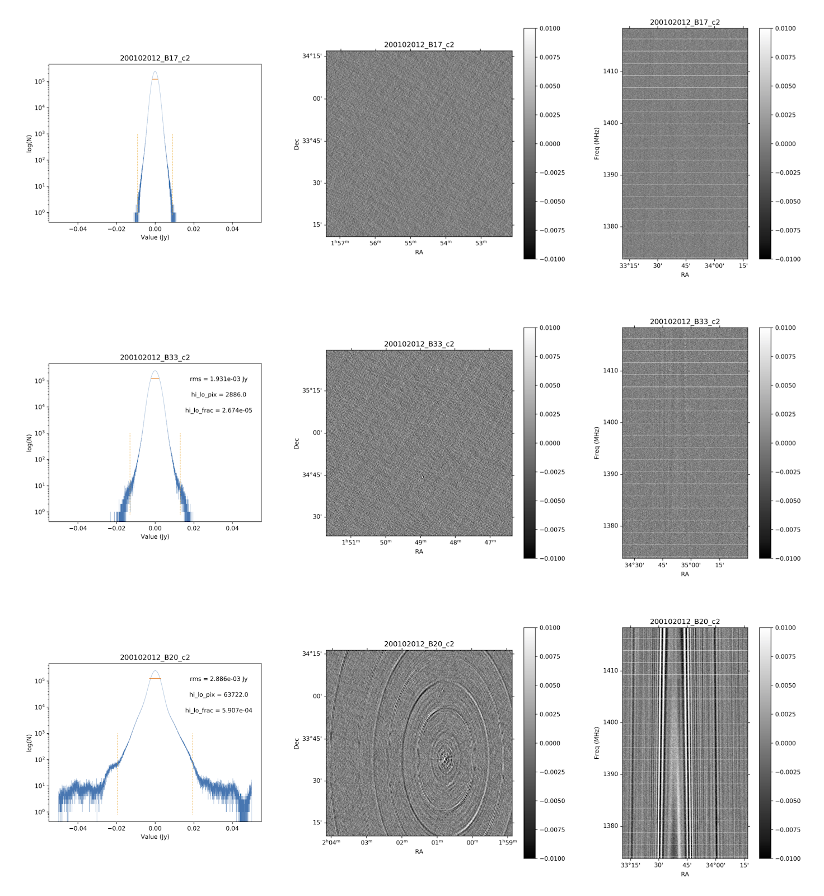
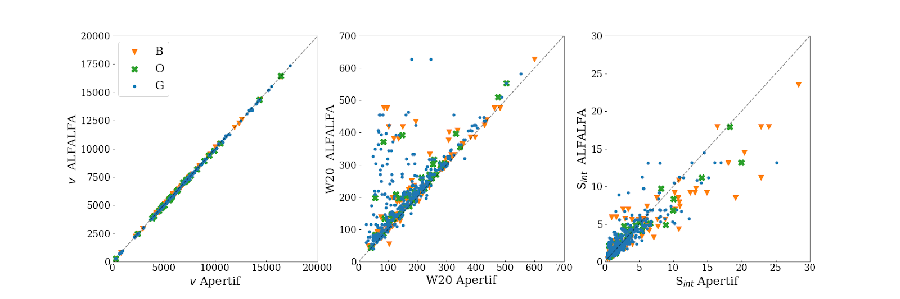
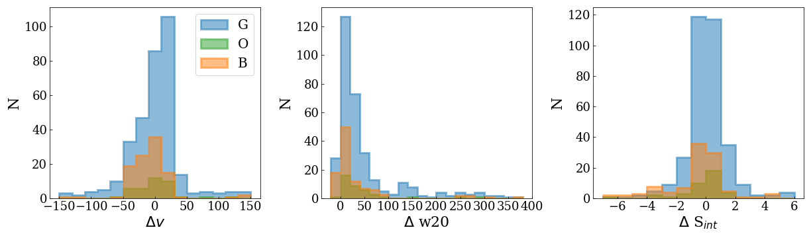

Data Products
===============

Available data products
#########################
Raw data Products
******************
Raw observational data
-----------------------
The raw observational data is recorded in measurement-set (MS) format. A survey field observation consists of forty beams covering the field; with all dishes the size of this dataset is 4.6 TB. A set of calibration scans consists of 40 separate observations taken in succession. For each calibrator scan only one beam contains the calibrator. All other beams not containing the calibrator are discarded. These observations vary in between 3–5 minutes and the total datasize for a complete calibrator scan (all forty beams) is 64-106 GB. The calibrator observations are taken at a higher time resolution than the survey fields (10 vs. 30 seconds) to allow better RFI excision due to their shorter integration time. The raw data are stored in long-term storage at `SurfSARA <https://userinfo.surfsara.nl/>`_ to enable future reprocessing with improvements to the :ref:`Apercal` pipeline.

Inspection plots
-------------------
Upon ingest to ALTA, inspection plots showing various views of data quality are created. The majority of these plots show the behavior per compound beam, with different slices of the data to highlight different aspects of quality. Example inspection plots can be found ` <https://alta.astron.nl/science/inspectionplots/190411002>`_. These plots are\:

    * Amplitude(all): Amplitude across all beams, averaged over all parameters
    * Amplitude f(time): Amplitude across all beams, concentric circles as a function of time inwards (start * to end)
    * Amplitude f(antenna):  Amplitude across all beams, concentric circles as a function of antenna inwards (RT2 to RTD)
    * Amplitude f(baseline): Amplitude across all beams, concentric circles as a function of baseline inwards (in MS order)
    * Phase (all): Phase across all beams, averaged over all parameters
    * Phase f(time): Phase across all beams, concentric circles as a function of time inwards (start to end)
    * Phase f(antenna):  Phase across all beams, concentric circles as a function of antenna inwards (RT2 to RTD)
    * Phase f(baseline): Phase across all beams, concentric circles as a function of baseline inwards (in MS order)
    * Amplitude vs time: Baseline plot of amplitude as function of time, coloured by MS order of baselines
    * Amplitude vs channel: Baseline plot of amplitude as function of channel, coloured by MS order of baselines
    * Phase vs time: Baseline plot of phase as function of time, coloured by MS order of baselines
    * Phase vs channel: Baseline plot of phase as function of channel, coloured by MS order of baselines
    * Waterfall\: scaled amplitude : Waterfall plot of amplitude as a function of channel (x-axis) and time (y-axis),with fixed scaling
    * Waterfall\: unscaled amplitude:  Waterfall plot of amplitude as a function of channel (x-axis) and time (y-axis), no scaling
    * Waterfall\: scaled phase: Waterfall plot of phase as a function of channel (x-axis) and time (y-axis), fixed scale
    * Waterfall: unscaled phase: Waterfall plot of phase as a function of channel (x-axis) and time (y-axis), no scaling

In addition, there are plots for a single beam, either the central compound beam for a target observation or the compound beam containing a calibrator for calibrator observations showing a full view of the data. These plots are\:

        * Beams XX: Waterfall plots of phase (upper right) and amplitude (lower left) for the XX polarization as a function of frequency (x-axis) and time (y-axis) for each baseline pair given by the antenna names (middle diagonal)
        * Beams YY: Waterfall plots of phase (upper right) and amplitude (lower left) for the YY polarization as a function of frequency (x-axis) and time (y-axis) for each baseline pair given by the antenna names (middle diagonal)

Processed data products
************************
The Apercal pipeline (see “`Apercal overview and structure<https://www.astron.nl/telescopes/wsrt-apertif/apertif-dr1-documentation/apercal/overview-and-structure/>`_”) calibrates the data and produces final images and cubes per compound beam. All data products described below are for an individual compound beam, of which there are forty per observation. These data products are not primary-beam corrected; primary-beam images are provided separately (see the "`Primary beam response <`" section, specifically “Released primary beam images”, and “User Interfaces”); these may be used for mosaicking or for correction of individual images.

Processed data products are ingested back into ALTA on a per-beam basis, and in “Released processed data products” we motivate the choice to release data on a per-beam basis. Note that the release of a beam releases all processed data associated with that beam.

An important note is that currently only the upper 150 MHz of the band is processed; thus the processed data products are produced over the range 1280-1430 MHz. Moreover, the first 12.5 MHz of data are flagged due to persistent RFI, therefore the resulting central frequency is 1361.25 MHz. The nominal bandwidth is then 137.5 MHz, but effectively it could be smaller due to additional RFI flagging. The (currently archived) data products are described below:

* **Calibration tables**

  The crosscal module portion of Apercal produces calibration tables that can be applied to the original data to reproduce the cross calibration. These tables are in standard CASA/MS format and a summary of all the calibration tables is provided in :numref:`cal_table` , where 3CFFF refers to a flux/bandpass calibrator (namely, 3C147 or 3C196; occasionally 3C295) and 3CPPP to a polarization calibrator (namely, 3C286 or 3C138).

  .. csv-table:: Calibration tables and naming scheme.
    :align: center
    :header: "Table description", 	"Table name"
    :widths: 20, 20
    :name: cal_table

    Global delays, 3CFFF.K
    Bandpass solutions, 3CFFF.Bscan
    "Intermediary, initial phase solutions", 3CFFF.G0ph
    Final complex gain solutions, 	3CFFF.G1ap
    Crosshand delay, 	3CPPP.Kcross
    Leakage terms, 	3CFFF.Df
    XY phase offset, 	3CPPP.Xf

* **Full time, Stokes and spectral-resolution calibrated visibility data**

  After the completion of the self-calibration, the final selfcal solutions are applied to the full spectral resolution uv data, and this uv dataset is written out as a UVFITS file as an intermediate data product. Currently, the final calibrated uv-data are stored at full time and spectral resolution for all polarizations; this may change with future updates to the processing pipeline.

* **Continuum images**

  A multi-frequency Stokes I image is created over the full processed frequency range (currently 150 MHz; effectively less due to RFI occupancy) and saved as a FITS file for each beam. These images are 3.4°×3.4°(3073×3073 pixels, with 4′′/pixel). This samples well outside the primary beam response but is necessary to account for cases where a strong source is in a side-lobe and needs to be included in the self-calibration model and cleaning. Sources above 5-σ should be identified and cleaned to the 1-σ level.

* **Polarization images and cubes**
  A multi-frequency Stokes V image over the full bandwidth is produced. This image matches the continuum image in spatial extent: 3.4°×3.4°(3073×3073 pixels, with 4′′/pixel). In order to prevent bandwidth depolarization and enable rotation measure synthesis studies, Stokes Q and U cubes with a frequency resolution of 6.25 MHz are produced. The cubes have a smaller spatial extent of 2.7°×2.7°(2049×2049 pixels, with 4′′/pixel).

* **Line and dirty beam cubes**

  Four line cubes over a set of different frequency ranges are produced. :numref:`cube_params` summarizes the covered frequency ranges and provides the corresponding redshift range for HI. The lowest redshift cube is produced at full spectral resolution while other cubes are produced with a 3-channel averaging. These cubes have a spatial extent of 1.1°×1.1°(661×661 pixels, with 6′′/pixel). As the Apercal pipeline does not provide source finding or cleaning of the line cubes, corresponding dirty beam cubes, with twice the spatial coverage, are also archived to allow offline cleaning of source emission.

  .. csv-table:: Frequency/velocity coverage and resolution for all line cubes. Velocities use the optical definition and velocity resolutions are for the center frequency/velocity of each cube.
    :align: center
    :header: "Cube", 	"Frequency Range MHz", 	"Velocity Range kms", 	"Redshift range", 	"Frequency Resolution kHz", "Velocity Resolution kms"
    :widths: 20, 20, 20, 20, 20, 20
    :name: cube_params

    Cube0, 	 1292.5 -- 1337.1, 	 18110 -- 28226, 	 0.062 -- 0.099, 	 36.6, 	 8.3
    Cube1, 	 1333.1 -- 1377.7, 	 9155 -- 19005, 	 0.031 -- 0.065, 	 36.6, 	 8.1
    Cube2, 	 1373.8 -- 1418.4, 	 424 -- 10005, 	0.001 -- 0.034, 	 36.6, 	 7.9
    Cube3, 	 1414.5 -- 1429.3, 	 -1873 -- 1250, 	 0 -- 0.004, 	 12.2,   2.6

A summary of all the archived data products and their sizes (per beam and for a complete observation) are provided in :numref:`archived_data` :

.. csv-table:: Summary of archived data products, including their format and sizes. For visibility data, the dimensions are for polarization and frequency. For images and cubes, the dimensions are for spatial sizes and frequency (when appropriate). The calibrator visibility sizes are after pruning to keep only the Apertif beam that contains the calibrator, and the range of sizes reflects the different calibrator scan lengths.
  :align: center
  :header: "Data product", 	 "Format", 	 "Dimensions", 	 "Size per beam", 	 "Size per observation"
  :widths: 20, 20, 20, 20, 20
  :name: archived_data

  Survey field raw visibility data, 	  MS, 	 4 x 24576, 	 117 GB, 	  4.7 TB
  Calibrator raw visibility data, 	 MS, 	 4 x 24576, 	 1.6-2.6 GB, 	 64-104 GB
  Calibration tables, 	 MS table, 	 "--", 	 660 MB, 	 26.3GB
  Self-calibrated visibility data, 	 uvfits, 	 4 x 12288, 	 58 GB, 	  2.3TB
  Multi-frequency synthesis beam images, 	 fits, 	 3073 x 3073, 	 37 MB, 	 1.5 GB
  Stokes Q and U cubes, 	 fits, 	 2049 x 2049 x 24, 	 1.5 GB, 	 62 GB
  Stokes V multi-frequency synthesis image, 	 fits, 	 3073 x 3073, 	 37 MB, 	 1.5 GB
  Continuum-subtracted dirty line cubes, 	 fits, 	 661 x 661 x 1218, 	 8, 	 320 GB
  Restoring beam cubes, 	 fits, 	 1321 x 1321 x 1218, 	 320, 	 1.28 TB

Validation of data products
###########################
Continuum
**************

Image validation
-----------------
The continuum images were individually validated for every beam. In order to do this, a set of metrics was defined which inform on different aspects of image quality. The starting point of the validation are the residual images obtained after cleaning the continuum images. The validation aims at checking to what extent these images only contain Gaussian noise. The premise being that any significant deviation from this indicates issues with the calibration and/or the reduction of the data.

The following parameters were derived for each residual image.

* σ_in: Noise in inner half degree of the image, determined in a robust way from the residual image using the median of the absolute values.
* σ_out Noise at the edge of the residual image, more than a degree from the centre  determined in a robust way from the residual image using the median of the absolute values. This value is taken as a reasonable measure of the expected noise.
* R=σ_in/σ_out: A measure of the strength of artifacts left in the centre of the residual image.
* Ex-2:  Area, in units of beam area, with values below 2 σ_out in the inner 0.5 degree of the residual image, in excess of what expected from a purely Gaussian distribution. For perfect noise Ex-2 = 0.
* MaxNeg: the level, in units of σ_out, at which the area covered by pixels with values below this level is 10 beams. The expected value is -3.2. More negative values indicate significant negative calibration residuals.

Note that we did not use the equivalents of the parameters Ex-2 and MaxNeg based on positive deviations from Gaussianity (Ex+2 and MaxPos). This is because many residual images have weak, positive residuals due to insufficient cleaning which would then dominate the validation.

Visual examination of a large set of images was undertaken to define the numerical criteria that would catch significant image artifacts, as used above. The main types of image artifacts due to errors in the selfcalibration as well as strong direction-dependent errors for which the calibration pipeline did not attempt to correct. The criteria were set so that the large majority of images which were visually assessed as good would pass while only a small fraction of images that were visually assessed as bad would be classified as good.

The final criteria used to reject images are:
* R > 1.225. This criterion catches stripes due to errors in the amplitude calibration.
* R > 1.15, MaxNeg < -4.5 and Ex-2>400. This criterion catches general image artifacts and deviations from Gaussianity in the residual image.

Two additional criteria were set based on survey specifications:
* σ_in or σ_out  > 60 microJy/beam. In this case the noise of the image does not meet the  minimum requirement to be considered survey quality and valid.
* The minor axis of the restoring beam is > 15 arcsec. This occurs when both dishes RTC and RTD are missing from an observation. In this case, the required angular resolution of the survey is not met.

Flux scale & astrometry
---------------------------
For checking the consistency of the flux scale two beams of an observation of a field in the Perseus-Pisces region centered on RA(J2000) = 01h55m and Dec(J2000) = 33d56’ which was observed ten times between September 2019 and January 2020 were examined. The automatic source finder PyBDSF (also used in the Apercal pipeline) was used to find and determine source fluxes, positions and sizes and compared these from observation to observation. We restricted the comparison to sources that are less than 35” in size and have fluxes above 3 mJy (100 times the typical rms noise)  and agree in position to within 3 arcsecs to ensure that the sources used for comparison are indeed identical and have been included in the clean masks.

The overall consistency is very good with a mean of 1.014 and an rms of 4% . If one excludes the two most discrepant observations (ObsID 191207035 and 191227014) the rms decreases to 2%. :numref:`flux_ratio_10` provides the flux ratio of 10 observations relative to the last observation made on 06.01.2020 (ObsID 200106010)

.. csv-table:: The flux ratio of 10 observations relative to the last observation made on 06.01.2020 (ObsID 200106010)
  :align: center
  :header: "ObsID", "Median Flux Ratio"
  :widths: 20, 20
  :name: flux_ratio_10

  190919049, 0.9982
  191207035, 0.9311
  191223022,  1.0041
  191225015,  1.0116
  191227014,  1.1069
  191229014,  1.0185
  191231013,  1.0062
  200102012,  1.0446
  200104011,  1.0222
  200106010,  1.0000

An example of two observations (ObsID 200106010 and 190909049, observed at 06.01.2020 and 09.09.2019 respectively) compared to one another is shown in :numref:`flux_cmp_1`. Plotted is the relative difference in flux versus the flux in the 06.01.2020 observation.

  Relative flux difference between the sources in a mosaic of ObsID 200106010 and a mosaic of ObsID 190909049 as a function of their flux measured in ObsID 200106010.

To assess the agreement with the NVSS we made mosaics of the full field of view (40 beams) of all observations using the measured shapes of the 40 beams. The reason for using mosaics rather than individual beams was to have a large enough number of sources for the comparison as in an individual beam there usually are only of order a dozen that are bright enough. The mosaicing routine takes into account shapes of the beams made with the phased array feeds as determined from drift scans across Cygnus A (see the section on Primary beam response: Drift scan method) and corrects for the presence of correlated noise in adjacent beams. The mosaics were made with a resolution of 28" x 28". We ran PyBDSF on the mosaics to produce a source catalog and compared sources in this catalogue with the sources in the NVSS source catalog extracted from VizieR. For the comparison we restricted ourselves to sources that agree in position to within 4", are less than 28.5" in size and stronger than 3 mJy in the Apertif mosaic.

:numref:`flux_ratio_2` captures the comparison of the individual mosaics with the NVSS. For each ObsID the median flux ratio NVSS / Apertif is given. On average the Apertif flux scale is 3% above the NVSS flux scale for these mosaics with an rms of 4%. If the two most discrepant ObsIDs are omitted (191207035 and 191227014) the rms reduces to 2%. :numref:`flux_cmp_2` illustrates the agreement between the Apertif and NVSS flux scale for ObsID 200102012. Since the observing frequency of the mosaic is 1360 MHz as opposed to the 1400 MHz of NVSS ~2% of the flux difference can be accounted for by spectral index effects (assuming an average spectral index of -0.7) which were not taken into account.

.. csv-table:: Median flux ratio NVSS/Apertif for each ObsID
  :align: center
  :header: "ObsID", "Median Flux Ratio"
  :widths: 20, 20
  :name: flux_ratio_2

  190919049, 0.943
  191207035, 0.894
  191223022, 0.962
  191225015, 0.969
  191227014, 1.083
  191229014, 0.980
  191231013, 0.974
  200102012, 1.004
  200104011, 0.976
  200106010, 0.964

A flux scale comparison using the beam shapes determined from a direct comparison of the DR1 observations with NVSS using a Gaussian process regression technique provides a better picture as all DR1 data are used rather than just one field.

  Relative flux difference of sources in the NVSS catalogue and sources measured in an aperitif mosaic of ObsID 200102012 as a function of the flux of the sources in the NVSS catalogue

This is described in "Characterization of the primary beams" and yields a current estimate of the flux scale of Apertif as compared to NVSS. From this comparison the Apertif fluxes are on average 9% higher than those of NVSS, accounting for a nominal spectral index of the sources of -0.7.

Since we had to match sources in Apertif and NVSS for the source comparison we also obtained information on the agreement between the Apertif and NVSS astrometry. :numref:`flux_cmp_3` shows the positional differences for sources in the mosaic of ObsID 200102012 and the NVSS catalogue. The agreement is very good with mean offsets of 0.05 +/- 0.2  arcsec in RA and -0.05 +/- 0.2  arcsec in Dec.

  Position difference between the sources in the NVSS catalogue and the sources detected in the mosaic of ObsID 200102012.

Polarization
**************
Validation of polarisation cubes/images
--------------------------------------------

Two types of polarisation products are generated by the pipeline. The first one being cubes of Stokes Q and U of 24 images each covering a bandwidth of 150 MHz resulting in a frequency resolution of 6.25 MHz. The second products are Stokes V images generated from the whole combined bandwidth of 150 MHz.

Due to the different characteristics of these products two different sets of metrics were used to validate their quality. These metrics are very similar to the ones used for the continuum validation, but needed to be adjusted due to the following reasons:

# Due to the physical nature of Stokes Q, U and V emission in the cubes can be a positive or negative quantity while it can only be positive in Stokes I.
# Image artefacts are mostly influenced by the instrumental leakage characteristics of the primary beam in combination with direction dependent effects. This means that the strongest artefacts often appear for sources far away from the beam centres where the instrumental leakage is higher.
# For Stokes Q and U even faint artefacts in individual images can stack up if those are present over the whole cube at a similar position once the RM-Synthesis technique is applied in later stages of the analysis. This is also possible vice versa where strong artefacts in an individual image can be averaged out in this process and lead to a good image quality after RM-Synthesis processing.
# Stokes V represents the circular polarisation. Astronomically circularly polarised sources are extremely rare and most often show percentage polarisation of below 1%, so that Stokes V images should normally be regarded as empty.

In the following we describe the sets of metrics and the determined values for the quality assurance of the polarisation cubes/images. All values and the validation information for released beams is available in the table of the survey data release for polarisation observations.

Stokes V validation
-----------------------
The following parameters were derived for each Stokes V  image:

* σ_in: rms in the inner part of the image, which is defined as a radius of <30′ around the central coordinate of a beam [microJy/beam]
* σ_out: rms in the outer part of the image, which is defined as a radius of >60′ around the central coordinate of a beam [microJy/beam]
* FT_max: Absolute of the Fourier Transformation of the image. This value gives a good measure of repeating structures in the image such as amplitude artefacts which manifest as stripes.
* peak_inner: The maximum of the absolute values of the inner part of the image as defined in σin (see above) [microJy/beam]
* b_min: The diameter of the FWHM minor axis of the synthesised beam [arcseconds]

A Stokes V image fails validation if one of the following criteria is met:

# σ_in and/or σ_out > 60 microJy/beam. This is the same value as for the continuum validation.
# b_min > 15''. This criterium filters any images for observations where failing or missing dishes are raising the FWHM of the synthesised beam above a value which is not acceptable for the survey.
# FT_max > 25. This value was empirically determined and filters any image, which is suffering from leftover RFI or strong amplitude errors.
# peak_inner > 4mJy. Images with values above this limit are most likely strongly affected by instrumental leakage and in most cases also show strong artefacts.

The first two criteria match that of the continuum validation and are based on survey specification. The second two criteria were empirically determined to filter images with strong polarization artefacts.
Stokes Q&U validation

Stokes Q/U cubes are validated depending on how many planes in a cube fail the following two criteria:

# The synthesised beam's minor axis of an image is larger than 17.5''. We are using a slightly larger value here compared to the continuum or Stokes V validation due to the fact that the beam becomes larger for images at lower frequencies.
# The rms noise in an image is larger than 300 microJy/beam. This corresponds to the same noise level as for the continuum and Stokes V images assuming a homogeneous noise distribution along the frequency axis. Stacking 24 images would reduce the noise by a factor of ~5.

Beams where more than one third of the images (>8) in Stokes Q or U are failing either of the above mentioned criterium do not pass the validation.

The table of released polarisation beams includes the following columns that describe the Stokes Q/U data quality:

* Qbeam_frac: Fraction of Q image planes failing criterium 1. [0.0-1.0]

* Ubeam_frac: Fraction of U image planes failing criterium 1. [0.0-1.0]

* Qnoise_frac: Fraction of Q image planes failing criterium 2. [0.0-1.0]

* Unoise_frac: Fraction of U image planes failing criterium 2. [0.0-1.0]

HI
********
Cube Validation
---------------------
The quality of the HI line data was validated in multiple steps. We concentrate the analysis on cubes 0, 1, and 2 (see Table 2 **REF** in the "Available data products" document for the frequency ranges of the cubes), as the quality of cube 3 always followed that of cube 2 due to both of them being in adjacent low-RFI frequency ranges.

As a first step all cubes 0, 1, and 2 where the average rms noise was larger than 3 mJy/beam were rejected. Inspection of the cubes showed that such large noise values always indicates the presence of major artefacts in the cube.

We then constructed noise histograms for cubes 0, 1 and 2 of each observation and beam combination. We made no attempt to flag any sources prior to determining the noise histogram. The HI cubes are mostly empty (i.e. consist of noise pixels) and real sources have no discernible effect on the histogram. The only exception is that all cubes 0 were blanked below 1310 MHz to remove the impact of residual RFI at these frequencies.

We also extracted representative channels as well as position-velocity slices from each cube. The cubes of 14 observations (~550 cubes) were inspected by eye for the presence of artefacts and to gauge the impact and effect of data artefacts on the noise histograms.

Artefacts generally fell in two categories: due to imperfect continuum subtraction and due to imperfect sub-bands, which we discuss in turn.

* **Continuum subtraction artefacts**

Continuum subtraction artefacts (and with it the presence of residual grating rings) add broad wings with extreme positive and negative values to the noise histogram. Trial and error showed that these wings could be robustly detected by quantifying the fraction fex of the total number of pixels with an absolute value flux value >6.75σ where σ is the standard rms noise in the cube. While adding wings of extreme value pixels to the histogram, these artefacts in general do not affect the Gaussian shape of the central part of the histogram (i.e., at low σ values).

* **Sub-band artefacts**

The presence of sub-bands with lower quality (i.e., a higher noise) manifests itself not by wings of extreme pixels but by a systematic change in the shape of the histogram through the addition of "shoulders" to the histogram (lower kurtosis). Trial and error showed that the presence of these features were best detected by comparing the rms width of the histogram with that at the level of 0.8 percent of the maximum of the histogram. We define the parameter  p0.8 or the ratio of this 0.8 percent width and the rms.

We compared our "good", "bad" or "OK" rankings as determined by eye for the 14 observations with the corresponding fex and p0.8 values.  This is illustrated in **REF** where we show the distribution of all cubes 2 in the  fex-p0.8 plane with the cubes which we inspected by eye color coded to indicate their quality ranking.

"Good" cubes, i.e., those with no or very minor artefacts, were concentrated in a small part of parameter space obeying the following criteria:

* rms < 3 mJy/beam
* log(fex) < -5.30
* p0.8 < 0.25 fex + 5.875

A second criterion defines cubes of OK quality, containing some minor artefacts. This consists of cubes meeting the following conditions:

* rms < 3 mJy/beam
* -5.30 < log(fex) < -4.52
* p0.8 < 0.5 fex + 7.2

The upper limit of -4.52 of the second condition is not a hard limit and a slightly different value could also have been chosen. We found however that the values used here give a good compromise in minimizing the number of false qualifications of “OK” cubes

Cubes not obeying any of these two sets of criteria were considered “bad”.
Using these conditions we defined for all cubes 0, 1 and 2 a subset of good and OK cubes. Cube 3 in all cases follows the quality designation of cube 2.

:numref:`qa_overview` shows the noise histograms and a representative channel map and position velocity slice for each of the three quality categories.

Whether a cube is part of the data release is determined by the quality criteria of the corresponding continuum image. This is described in more detail in the document “Released processed data products”. The quality of each cube and the metrics used to determine that quality are included in the VO table describing the released HI observations (see "User interfaces").

  Distribution of cubes 2 of all beams in the fex-p0.8 plane (grey points). Overplotted are quality assessments of the beams of 14 observations. Good cubes are indicated by green points, OK by orange points and bad cubes by red points. The blue lines indicate the regions where cubes are considered good (left region) or OK (right region).

  Examples of the three quality classes used for the HI quality assessment. The top row shows an example of a "good" observation (Obsid 200202012, beam 17, cube 2), the middle one an "OK" observation (Obsid 200202012, beam 33, cube 2) and the bottom one a "bad" observation (Obsid 200202012, beam 20, cube 2). The columns show, from left to right, the noise histogram, an extract of the central velocity channel, and a position-velocity diagram through the center of the cube. In the plots in the left column the short horizontal line at the top indicates the rms. The two dotted vertical lines indicate the ±6.75 x rms values. The "good" observation in the top row shows hardly any artefacts and a Gaussian noise histogram. The "OK" observation in the middle row shows a minor continuum subtraction artefact (which in turn causes somewhat extended wings to the noise histogram). The "bad" observation in the bottom row shows major continuum subtraction artefacts, resulting in a very non-Gaussian histogram.

External comparison
------------------------

In order to further validate the line cubes, we performed preliminary source finding and cleaning of a subset of cubes using SoFiA-2 (Source Finding Application; Serra et al. 2015, https://github.com/SoFiA-Admin/SoFiA-2). Full details of this procedure are supplied in Hess et al. (in prep).

Comparison to ALFALFA
^^^^^^^^^^^^^^^^^^^^^^^^^
We compared the properties of HI detections in Apertif with the properties of HI detections in the ALFALFA catalogue (Haynes et al. 2018). We created a source catalogue with SoFiA and cross matched the detected sources with the ALFALFA catalogue. In 21 fields that overlap in the footprint of both surveys, we found 479 matching sources. Out of these, 336 sources were found in data cubes with "good" quality, 39 in data cubes with "OK" quality and 104 were found in "bad" quality data cubes. The results of the comparison are shown in :numref:`comparison_v4_val` and :numref:`histograms_with_val`. The color coding of these figures reflects the quality of the data cube in which the sources were identified with blue for "good", green for "OK" and orange for "bad".

Overall the properties of the Apertif detections agree well with the ALFALFA detections. There are some sources that have smaller line widths (w20) than the ALFALFA sources. This is likely connected to the flagging of 3 channels out of every 64 because of the strong dropoff in response (See “Aliasing” in “System notes”). Cubes 0, 1, and 2 have every three channels averaged together. Combined with the flagging of three channels out of every 64, this means that every 22nd channel in these cubes has no signal, and there are channels with ⅓ nominal sensitivity (periodicity of 42 and 21 channels) and ⅔ nominal sensitivity (periodicity of 63 channels). These flagged or partially flagged channels can result in a source being spectrally separated into two different detections. This then also results in smaller line widths for these sources. Another reason for the smaller line widths in Apertif can be extended emission detected in ALFALFA that gets filtered out by the interferometry.

  Comparing the properties of overlapping Apertif and ALFALFA sources. First panel\: systemic velocity, second panel\: W20 line width, third panel\: integrated flux. The different colored markers represent sources detected in “good” (G), “OK” (O), and “bad” (B) quality HI data cubes.

  Distribution of the difference in systemic velocity, W20 and integrated flux between Apertif and ALFALFA detections. The colors represent detections in “good” (G), “OK” (O), and “bad” (B) quality HI data cubes.
