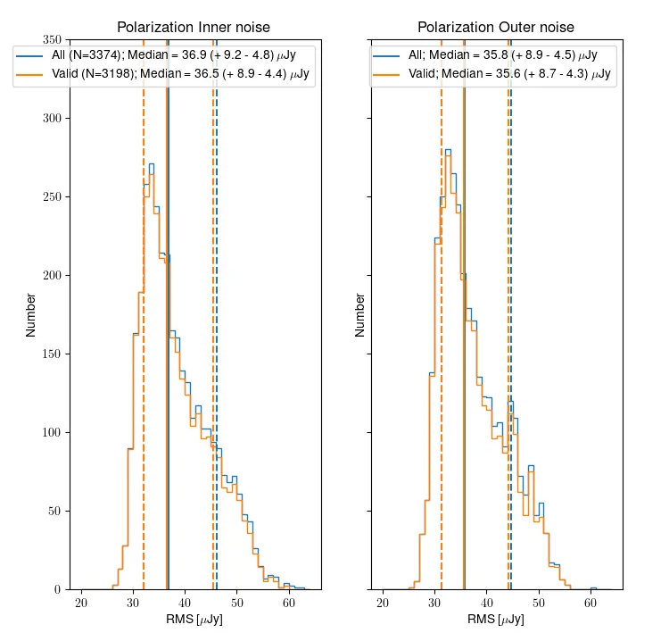

Image Quality
=============

Continuum image quality
#########################
All released continuum multi-frequency synthesis images have passed validation, ensuring that they meet the resolution requirements, minimum sensitivity requirements, and have no significant image artifacts, as described in "Validation of processed data products: Continuum".

The noise values for all released continuum images are shown in :numref:`dq_1`. The left panel shows the noise distribution on the inner part of image (inner hereafter) where many sources are detected. On the right panel the noise of the outer part (outer hereafter), which is typically source-free, is considered (see "Validation of processed data products: Continuum" for more details). The median values (41.4 and 36.1 uJy, respectively) are indicated by the solid lines. The dashed lines and numbers in parentheses indicate the noise values that bound 68% of all values around the median. The median value of the inner noise is slightly larger; this is because the inner part of the image has sources and may still have minor artifacts. The outer noise represents the theoretical best that can be achieved with perfect imaging. The median outer noise is 36.1 microJy/beam and the best achievable (5th percentile) is 29.3 microJy per beam.

The noise values skew to higher values from the median. This is likely because some images may still have minor imaging artifacts. Any issue affecting image quality will only ever increase the noise of an image.

.. figure:: images/data_quality_1-e1604930867107.png
  :align: center
  :width: 400
  :alt: Relative flux error
  :name: dq_1

  Noise distribution for all relased images in the inner (left) and outer (right) part of the continuum images.

Polarization data quality
#############################
All processed data products are released based on the continuum validation (see “Released Processed Data”). Thus, some polarization images and cubes may be released that do not pass their own validation. However, this is a small number of images/cubes and they may still be useful (see "Validation of processed data products: Polarization" for more details).

:numref:`dr_year1_pol_noise` shows the distribution of inner and outer noise for the Stokes V mfs images. Both all released images (3374) and only those that pass validation (3198) are shown. Very few polarization images fail the polarization validation after passing the continuum validation. This is to be expected as the validation criteria are very similar and the continuum and Stokes V mfs images should generally have similar quality to each other. There is no appreciable difference in the noise distribution between all released images and those that pass validation.

The same qualitative trends are present as for the continuum noise; the outer noise is lower than the inner, and the distribution of noise values is skewed to higher noise values, due to the presence of low level artifacts that increase the noise. Overall, the noise in the polarization images is lower than the continuum; this is likely because the Stokes V images are essentially empty.

  Noise distribution for all relased (blue) and valid (orange) Stokes V multi frequency images, in the case of the inner (left) and outer (right) part.

Line data Quality
#####################

Line cubes are released for a beam if the continuum image passes validation; thus some of the line cubes may fail their validation. The line cubes are classified as “good”, “okay” or “bad” depending on the severity of the artefacts in the line data, as detailed in "Validation of processed data products: HI".

:numref:`dq_3` shows the distribution of noise for cubes 0, 1 and 2. All released cubes are shown, plus split separately into the good, okay, bad categories. The median noise over all released cubes is 1.62 mJy/bm. The median noise decreases slightly as the cubes increase in frequency; this is consistent with the RFI environment being worse at lower frequencies. As is to be expected, the median noise for good cubes is better than for the okay cubes, which are better than the bad cubes. The best achievable noise (5th percentile, cube 2, only good) is 1.32 mJy/beam.

As with the continuum and polarization noise distributions, the distribution has a longer tail to higher noise values; this is because image artifacts and bad frequency ranges will only ever increase the noise.

  Noise distribution for all relased (blue), Good (green), Okay (orange) and bad (red) HI line cubes for cube 0, 1 and 2.

Data quality per compound beam
################################

The above views of data quality combine all released observations, across different compound beams. However, the behavior of different compound beams is not identical. Specifically, the outer compound beams illuminate the edge of the field of view and thus may be expected to have a reduced sensitivity. For reference, :numref:`dq_4` shows the compound beam layout, with colors indicating the expected sensitivity based on the forward gain of an Apertif phased-array feed (PAF).

:numref:`noise_beam_map` shows the normalized average noise (over all continuum images) in the compound beam layout. The beams on the edge of layout have higher average noise values, consistent with the picture that the overall sensitivity falls off. :numref:`dq_6` quantifies this by showing the normalized noise as a function of distance from the pointing center of the PAF; the increased noise values track with distance.

.. figure:: images/data_quality_4.png
  :align: center
  :width: 400
  :alt: Relative flux error
  :name: dq_4

  The compound beam layout for Apertif. Blue is at about the 50% level; transition between black/brown to green is at about the 85% level.

  The normalized average continuum noise per compound beam, shown in the compound beam layout. Compound beams closer to the edge have larger average noise values.

  The normalized continuum noise of each compound beam (labeled points) as a function of distance from pointing center of the PAF. The pattern of increased noise scales with distance from center of the PAF.
