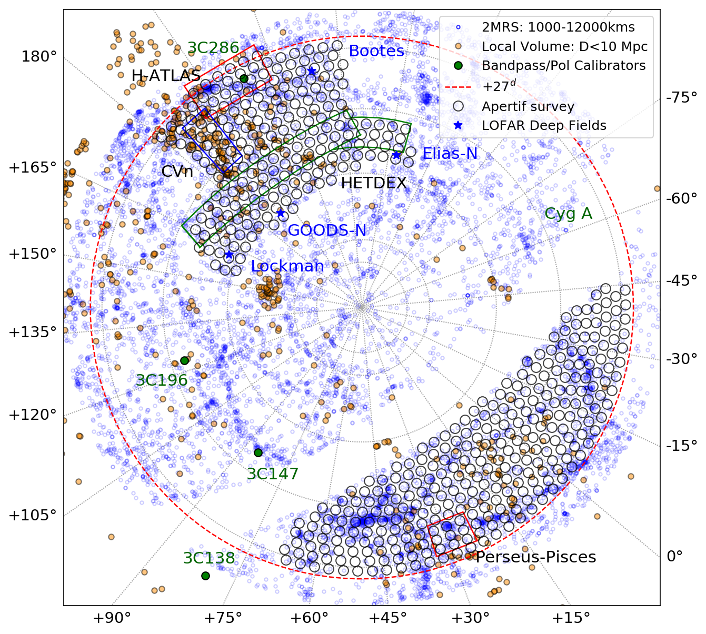

Introduction
============
Apertif is a new phased-array feed (PAF) system installed on twelve of the fourteen dishes of the Westerbork Synthesis Radio Telescope (WSRT). Each PAF consists of 121 Vivaldi elements; the signal from these elements is combined with different weights to form forty adjacent beams across the sky, greatly increasing the field of view. Each Apertif beam is a distinct primary beam response on the sky. Throughout this documentation, an Apertif (primary) beam is sometimes referred to as a “compound beam”, emphasizing it is formed from the response of multiple individual elements.

The imaging survey observations occur in the frequency range 1130-1430 MHz [1]_, corresponding to a redshift of 0.26 for HI. While the lower half of this band is significantly affected by RFI, it offers a large cosmic volume for observing HI. The 24576 channels provide a frequency resolution of 12.2 kHz, or 2.6–3.2 km/s across the band for HI. The angular resolution of the imaging survey observations is ∼ 15′′×15′′/sin(δ). Imaging survey observations occur roughly four weeks out of every six weeks, with the other two weeks dedicated to time-domain surveys. The exact cadence of observations is adapted to suit maintenance and operational needs. A full description of the imaging survey observing strategy will be given in Hess et al. (in prep).

.. [1] Note that only the upper 150 MHz is currently processed, see :ref:`Available data products` for more details.

Briefly, survey fields are observed for 11.5 hours, instead of a full 12-hour sythesis measurement, as a compromise between flexibility in scheduling and depth/maximum uv coverage. Calibrator observations alternate between a flux/bandpass calibrator (3C147 or 3C196, occasionally 3C295) and polarization calibrator (3C286 or 3C138); calibrators are observed in every Apertif beam as the different beams have different calibration solutions. Up to two survey fields can be observed in a row. Thus a survey field may be separated in time from its calibrator by ∼ 15 hours. Occasionally an observing session will start or end with a survey field in order to increase observing efficiency; then the separation in time may be longer. The calibration solutions were found to vary by less than 10% on timescales of ten days within the same beam weights model. This demonstrates that the system is stable enough to allow long periods between calibration scans with minimal impact on the absolute calibration.

The imaging survey footprint is focused on northern extragalactic sky; Hess et al. provide a full motivation of the choice of survey regions. The imaging survey is split into two tiers: a wide-shallow tier consisting of a single observation per field and a medium-deep tier consisting of ten observations per field. :numref:`apertif_pointings_ncp` below shows the full four-year survey footprint in the context of local extragalactic structure; the medium-deep regions are labelled.

  This figure shows a superset of Apertitf pointings (black empty circles) which are used to schedule the imaging surveys, as seen from the North Celestial Pole. Four regions of interest which will include some medium-deep pointings including Perseus-Pisces centered on Abell 272 (red); H-ATLAS (red); and HETDEX (green). Blue circles are galaxies from the 2MASS Redshift Survey between v=1000-12000 km/s which illustrate the large scale structure covered by Apertif. Orange dots are galaxies within v<550 km/s (~10 Mpc) from the Local Volume catalog by Karachentsev et all (2004). Green dots indicate the position of bandpass and polarization calibrators. Blue stars are the central positions of LOFAR deep fields.
