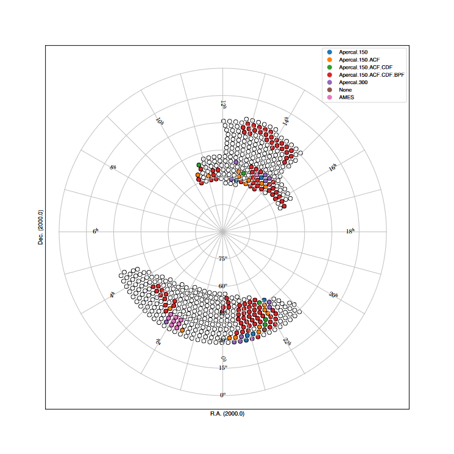
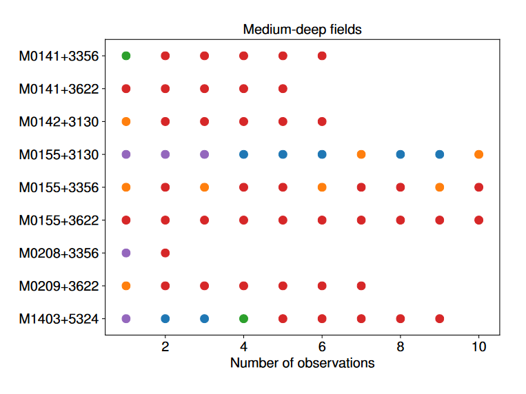
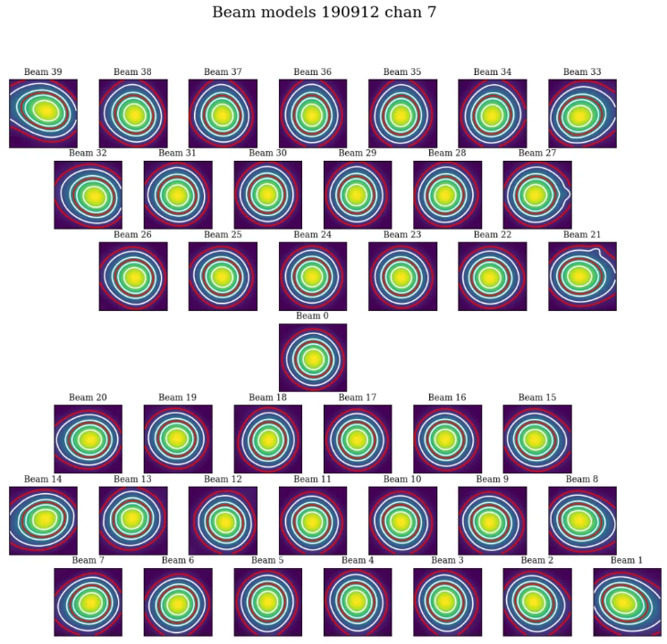
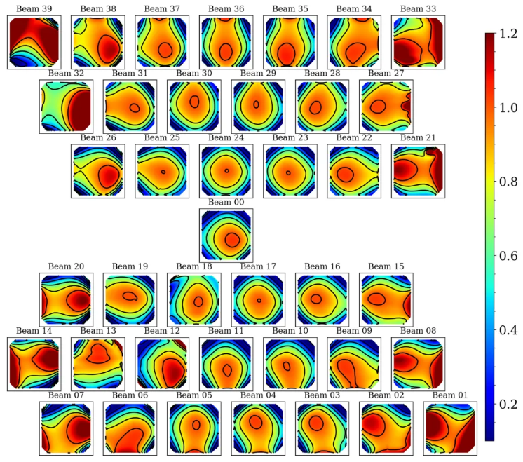
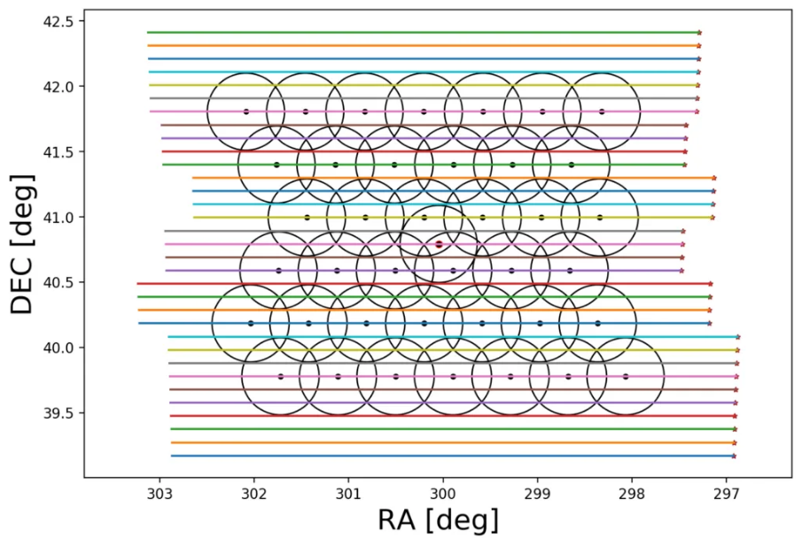
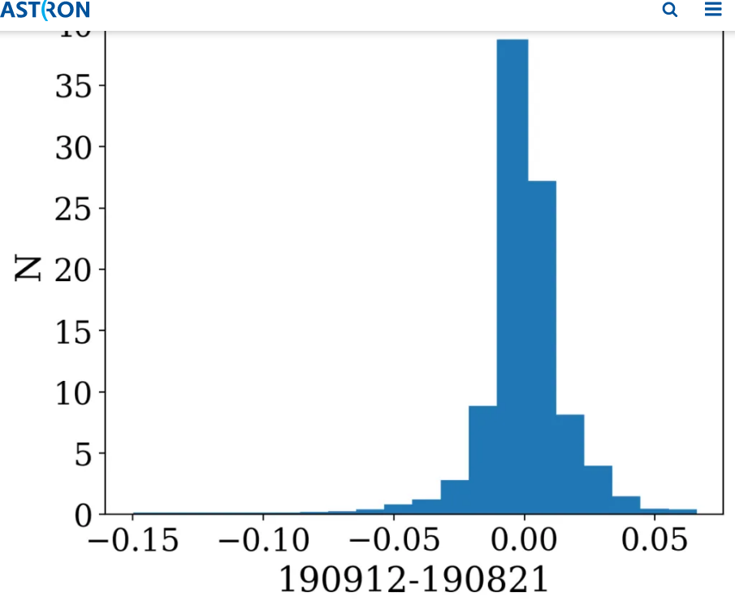
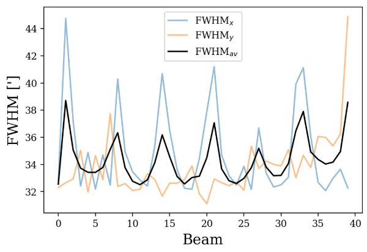
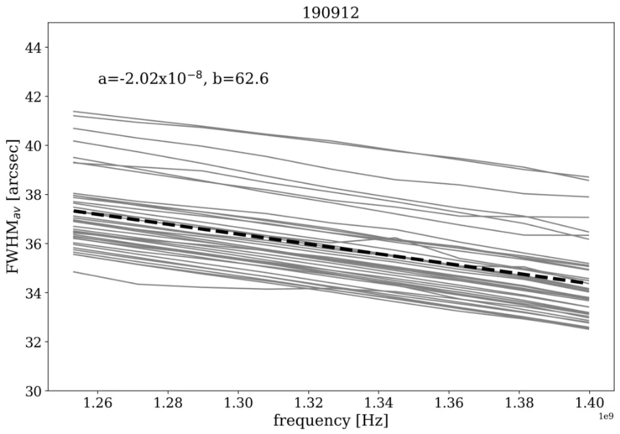
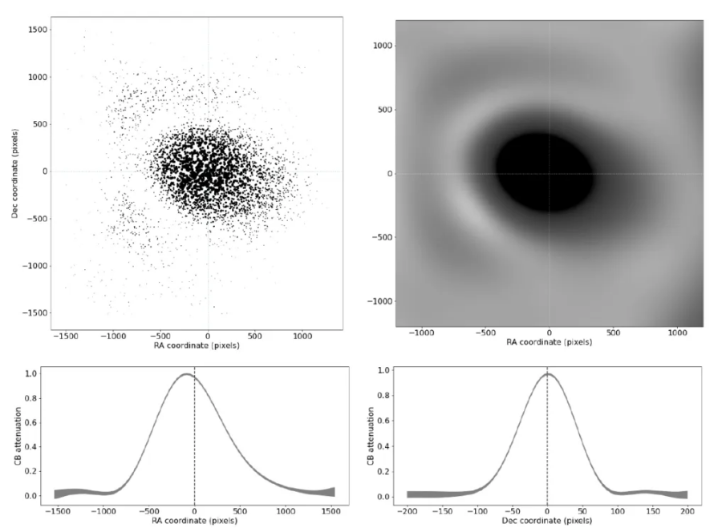
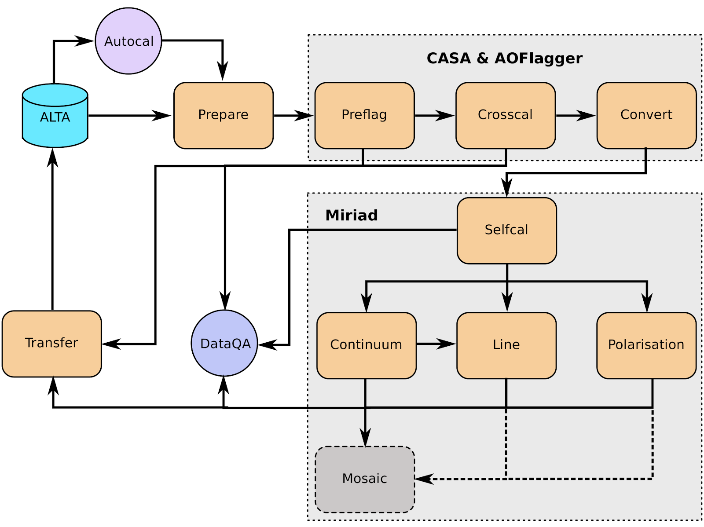

Observations & Processing
=========================

Released Observations
########################
All raw observational data from the imaging surveys through the first year of survey observations (1 July 2019 - 30 June 2020) are released. The survey medium-deep observations during this period were focused on  the Perseus-Pisces region, with an additional medium-deep field in the HETDEX region. The wide tier of the survey focused on the HETDEX region (for overlap with the LoTSS DR1), with additional coverage in the Herschel-ATLAS North Galactic Cap, and in the fall sky between 22h-0h. In total, there are 218 observations; 65 of these observations build repeated coverage of nine medium-deep fields. There are observations of 160 unique fields; with an effective field-of-view (based on spacing between fields) of 6.44 square degrees, the released observations cover just over 1000 square degrees of sky.

:numref:`dr_year1_apercal_processing_obs` shows the sky coverage of released observations, with the full four-year survey footprint shown for reference. The color coding indicates the version of the pipeline used for processing (see "Apercal versions applicable to the release" for details), where "None" means no processing was performed (see "Notes on specific observations"). "AMES" refers to observations in the medium-deep footprint, and :numref:`dr_year1_apercal_processing_ames` shows these repeated medium-deep fields separately as individual observations of a field may be processed by different versions of the pipeline.

  The sky coverage of released observations, with the full four-year survey footprint shown for reference. The color coding indicates the version of the pipeline used for processing (see "Apercal versions applicable to the release" for details).

   A view of the processing for medium-deep fields with repeat visits. The observations are ordered in time-order and the color code refers to the same processing as for the figure above.

Notes on the data quality/processing  for specific observations can be found here.

A machine-readable summary table of these observations can be exported using the VO infrastructure, more details are provided in section “User Interfaces”.

Primary Beam Response
#########################

Overview of primary beam shapes for Apertif
---------------------------------------------

Knowing the primary beam shape of a radio telescope is critical for deriving accurate fluxes away from the beam center. In the case of PAFs, the primary beam response, also known as the compound beam shape, must be independently measured for each compound beam as they are not constrained to have the same shape. Generally, formed beams further from the pointing center of the PAF will have more elongated shapes.

Full characterization of the Apertif primary beam is ongoing work. In this documentation we describe the methods used to measure the compound beam shapes (drift scan measurements and Gaussian process regression); describe the first release of primary beam images and plans for near-term updates; and offer an initial characterization of these released primary beam images.

We wish to emphasize that the use of the classic WSRT primary beam correction is not appropriate for Apertif. In addition to the fact that the compound beams can have non circularly symmetric shapes (see :numref:`beams_chan`), the sizes of the primary beams are different from the classic WSRT. The Apertif front-ends fill the focal plane more efficiently than the old MFFE frontends, leading to a smaller primary beam shape. :numref:`dif_oldwsrt` shows one set of measured compound beam shapes divided by the classic WSRT primary beam shape. In addition to the elongated shapes (and offsets) visible in outer beams, the Apertif primary beam value is generally smaller than the classic WSRT primary beam value, confirming the smaller primary beam shape for Apertif.

  Beam maps for all 40 apertif beams reconstructed from drift scans. Contour levels are: 0.1, 0.2, 0.4, 0.5, 0.6, 0.8. Red contours highlight the 10% and the 50% sensitivity level. These drift scans were measured in September 2019 and channel 7 corresponds to a frequency of ~ 1.363 GHz.

   Compound beam shapes derived from drift scans divided by the classic WSRT primary beam. Contours are: 0.2, 0.4, 0.6, 0.8, 1.0.

Drift scan method
------------------
Beam maps are produced from drift scans performed periodically on Cygnus A (CygA hereafter). Cyg A is chosen for the drift scans since it is one of the brightest compact radio sources in the northern sky, with a brightness of 1589 Jy (Birzan et al. 2004) an extent of approximately 5′ at 1.4 GHz, which makes it an unresolved continuum source for a single WSRT dish. During the drift scan measurement the PAF is at a fixed position on the sky and Cyg A drifts through the field of view in a straight line. The separation between the drifts is 0.1 degrees in declination. This is then repeated 31 times to cover the whole field of view of the 40 Apertif beams. :numref:`drift_scan_CygA` illustrates this process.

Drift scan observations are scheduled using the aperdrift code : https://github.com/kmhess/aperdrift

   Illustration of drift scan observations. The dots represent the beam centres of the 40 Apertif beams, and the lines represent individual drifts across the field of view of the Apertif footprint.

Beam models
^^^^^^^^^^^^^^
The auto correlation data from the drift scans is used to construct fits images of each beams response to Cyg A. Then we perform a 40 times 40 pixel spline interpolation for each beam to minimise the distorting effect of bad data (e.g. RFI) to the beam map. For this, we use the scipy package interpolate.RectBivariateSpline, which performs a bivariate spline approximation over a rectangular mesh to smooth the data.

Once the fitting is done, we write out the resulting beam maps into a csv table and also into 9 times 40 fits files corresponding to 9 frequency bins for all 40 beams.

We divide the 150 MHz bandwidth into 10 frequency bins when extracting the auto correlation data from the drift scans. From these we construct beam models at 9 different frequencies (chan 1-9). We do not use the first frequency bin (chan 0) because it is always badly affected by RFI.

The code to produce the beam maps is available at: https://github.com/apertif/aperPB

  Beam maps for all 40 apertif beams reconstructed from drift scans. Contour levels are: 0.1, 0.2, 0.4, 0.5, 0.6, 0.8. Red contours highlight the 10% and the 50% sensitivity level. These drift scans were measured in September 2019 and channel 7 corresponds to a frequency of ~ 1.363 GHz.

Time variability
^^^^^^^^^^^^^^^^^

Beam weights are measured at the start of every imaging observing run and are typically used for 2 weeks in a row. The beam weights define the shape of the compound beams. They depend on the quality of the beam weight measurement, (e.g. RFI at the time of the measurement) and also on the health of the system (e.g. broken elements on the PAFs, dysfunctional antennas). Drift scans are typically measured once per month due to the time intensive nature of the measurement. The beam models derived from drift scans observed at different times typically vary by a few percent (rms of the difference).

  Normalised distribution of the pixel by pixel difference between beam maps observed in September 2019 and in October 2019. The rms of the distribution is 0.018.

Beam size change with frequency
^^^^^^^^^^^^^^^^^^^^^^^^^^^^^^^^^^^
Beam shapes and sizes change across the field of view of Apertif with the central beams being more symmetric and the beams along the edge of the field of view more elongated. :numref:`chann_9` and :numref:`chann_7` show the average beam size (FWHM), and the FWHM along the x and y axis as a function of beam number. :numref:`chann_9` shows the beam size for frequency bin 7 (1.363 GHz) and :numref:`chann_7` shows the same for frequency bin 9 (1.399 GHz).

  FWHM as a function of beam number for channel 7 (1.363 GHz). The black line shows the average FWHM when fitting a 2D Gaussian function to the beam maps. The blue line shows the FWHM of the 2D Gaussian along the x-axis (r.a.) and the orange line shows the FWHM along the y-axis (dec). The shape of the CBs is not perfectly Gaussian, but a 2D Gaussian function is a good approximation for the beam shapes within a few percent.

  FWHM as a function of beam number for channel 9 (1.399 GHz). The black line shows the average FWHM when fitting a 2D Gaussian function to the beam maps. The blue line shows the FWHM of the 2D Gaussian along the x-axis (r.a.) and the orange line shows the FWHM along the y-axis (dec).

Beam sizes change linearly with frequency. The frequency dependence is on average: -2.108e-08 · freq [Hz] + 63.47. This is based on fitting a 2D Gaussian to each beam map at each frequency, taking the average FWHM from the 2D Gaussian fit and then fitting a first order polynomial to the FWHM vs. frequency for each bin. The results were then averaged for 14 different drift scan measurements. :numref:`size_freq` shows the average beam size for each 40 beams as a function of frequency bin for a set of drift scans (grey lines). The dashed black line shows the average fitted line to the data. Some of the beams occasionally show non smooth variation with the beam size (for example beam 7, see also in :numref:`chann_9`and :numref:`chann_7`). The cause for this in most cases is due to the effect of RFI in certain frequency bins.

  FWHM of CBs as a function of frequency bins. We divide the 150 MHz bandwidth into 10 frequency bins when constructing the CB maps. The grey lines show the average FWHM from the 2D Gaussian fit to each CB, while the dashed black line shows the average fitted line (a and b are the parameters of the line).

Gaussian process regression
------------------------------

A second method for measuring the compound beam (CB) shapes uses a comparison of the continuum images to the public NVSS catalog and Gaussian process regression (GPR) to construct the compound beam shape.

The Apertif images of each individual compound beam (CB) are convolved with a circular PSF of 45" to match the NVSS resolution. Then the source finding is performed, and the list is cross-matched with the NVSS catalog. After that the distribution of the relation between NVSS and Apertif total flux  e=SAPERTIF/SNVSS over a CB field of view is considered. In the absence of any biases it represents the corresponding compound beam shape.

An example of this relation is shown in :numref:`gauss`. The top left plot shows the distribution of 7153 sources over Beam 01 observed from August 2019 to June 2020. The size of each symbol corresponds to the fraction e.

All the data for a given CB (40+ epochs, a few thousands cross-matched sources) is considered and the scikit gaussian_process python library is used to construct a gaussian process regression for these data. For that, the mean value is subtracted from the data. The kernel for GPR is chosen as a sum of two squared exponentials and the one representing white noise. The first kernel represents the main CB shape, and the second one represents shorter scale irregularities. After the gaussian process is trained the regression surface is obtained. The surface is then normalized to take values between 0 and 1. An example of the GPR for Beam 01 is shown in the top right panel of :numref:`gauss`.

With this method the “average” CB shapes over the span of all observations are obtained. We note, nowever, that the shape of a CB can change in time because of re-measurement of the beamweights, broken/repaired PAF elements, or if a particular antenna is excluded from observation.

In order to address concerns about time-variability, the described method allows one to obtain the CB shape for a given observation, using only measurements obtained within a given beamweights set (usually a two week time span). Typically, around 500 cross-matched sources (5 - 7 observations) are needed to  build the GPR accurately.

These all-antenna CB models correspond to the middle frequency of the 150 MHz band  and can be scaled further to be used for the HI or polarization cubes.

  Top row -- the total flux ratio of APERTIF to NVSS and the corresponding GPR. Bottom row -- the GPR middle slices along RA and Dec.

Released primary beam images
--------------------------------

The initial primary beams to accompany the first data release are those derived from the Gaussian process regression (GPR). The flux ratios between NVSS and Apertif were examined for both the compound beams derived from GPR and the drift scan methodology (see "Characterization of the primary beams"). Both sets of compound beams show similar behavior in the inner region, but the primary beam images from the drift scan methodology show systematics in the outskirts of the primary beam response, likely related to source confusion when performing the drift scans. This is under active investigation but currently only the GPR compound beam shapes are released as these appear to behave better in the outer regions.

These primary beams are appropriate for the center frequency of the continuum images, 1361.25 MHz, over the frequency range 1292.5-1430 MHz. The drift scan measurements demonstrate the size of the compound beam changes linearly with frequency, as expected.

The provided primary beam images are created at 100” resolution and should be regridded to match the images/cubes they are used to correct. In addition, they can be applied to other frequencies by scaling the cell size (cdelt1 and cdelt2 keywords) linearly with frequency (see subsection "Beam size change with frequency" in "Drift scan method" for the scaling) before regridding to match the data product of interest.

Two sets of primary beam images are released for each compound beam. The first set (“orig”) is not normalized to have a peak response 1. By construction, applying these primary beam images to the Apertif data should result in measured fluxes that are consistent with those in the NVSS catalog. Note, however, that the derivation of the primary beam response images did not account for the slightly different center frequency of the Apertif continuum images (1361.25 MHz) compared to NVSS and thus there may be small changes in the flux scale due to spectral indices of sources (2% for a typical spectral index of -0.7).

The second set (“norm”) are primary beam images normalized to have responses between 0-1, as is typical for primary beam images.  Applying these primary beam images to the Apertif data will include systematic offsets between the measured Apertif fluxes and the NVSS catalog fluxes; this is discussed and quantified in "Characterization of the primary beams".

Characterization of the primary beams
----------------------------------------

In order to provide information on the reliability of the measured primary beam images, we undertake an empirical comparison to the NVSS catalog over the full data release. While similar in philosophy to the Gaussian process regression used to derive the primary beam images, this comparison provides information about overall systematics in the flux scale, in addition to quantifying the scatter in the accuracy of derived fluxes using the provided primary beam images. It also allows a direct comparison between the reliability and accuracy of primary beam images derived from different measurement techniques.

Briefly, in order to provide a comparison over the full data release, the following steps are taken for every continuum image in the data release:

* Convolve the Apertif continuum image to 45″ resolution
* Regrid the primary beam image to the Apertif continuum image
* Primary beam correct the Apertif image (mask below 10% response)
* Create an Apertif source catalog by running pybdsf; identify sources with S/N > 5
* Cross-match to the NVSS catalog

The cross-matches are recorded and later combined to build a global picture of a compound beam over the full data release.

The key value examined to understand and characterize the primary beam response images is the ratio of the Apertif integrated flux over the NVSS integrated flux. The first check was to look for systematics in this value as a function of position, since this could point to biases in the derivation of the primary beam responses. The primary beam images constructed from drift scans resulted in systematically higher flux ratios at the outskirts of the primary beam response in a consistent (south-west) direction for all compound beams. This points to an issue with source confusion around Cyg A which is under active investigation. This systematic was not seen in the primary beam images derived with the Gaussian process regression.

The key characterization of the primary beam images is to understand the impact they have on the flux scale. Flux validation of continuum images takes an initial look at this using a single medium-deep field to look at the internal consistency of the flux scale and compare to NVSS. With the full primary beam characterization, this can be examined for each compound beam in aggregate over the full data release. While the originally returned primary beam images from the Gaussian process regression match the NVSS flux scale by construction, it is informative to undertake the comparison for the normalized primary beam images as this provides information about any overall differences in the flux scale between Apertif and NVSS (which would also be seen in primary beam images derived from the drift scan approach). Cross-matched sources were filtered to have a deconvolved major axis in the NVSS catalog < 45” and to have a measurement error on the ratio of integrated fluxes between Apertif and NVSS <0.1. Table 1 provides (as a csv file) the median ratio between the integrated fluxes, along with the standard deviation of the flux ratios and the median measurement error on the flux ratio. Table 2 provides (as a csv file) these same values but limited to the inner part of the primary beam images where the response level is ≤50%. The typical value is 1.11 in both regimes, indicating the Apertif fluxes are systematically ~10% higher than those from the NVSS catalog. The Apertif fluxes are expected to be ~2% higher based on a typical spectral index of -0.7 and the difference in center frequency in between Apertif and NVSS. In addition, the NVSS integrated fluxes are catalog flux values, corrected for various biases, while the Apertif integrated fluxes are measured directly from the images and may include calibration and clean biases. This will be examined in more detail in the forthcoming data release paper (Adams et al., in prep).

Table 1 and 2 also include the standard deviation of the flux ratios for each compound beam. These values are rather large, typically ~16-17%. This does not indicate an uncertainty in the primary beam measurement at this level as there are several contributing factors. The typical measurement uncertainty is ~5%, and intrinsic source variability is on the order of ~10% (e.g., Hovatta 2009). The data release paper will undertake an accounting of all sources of scatter to quantify what the uncertainty on the flux scale from primary beam variability might be. In addition, the internal consistency of flux measurements for all medium-deep observations in the data release will be undertaken to provide an additional handle on the accuracy of the flux scale within the Apertif datasets.

Table 1: Median ratio of Apertif/NVSS integrated flux, standard deviation of flux ratio, and median measurement error of flux ratio over the full Apertif primary beam (to 10% level)
::download:`content/Table-1-Median-ratio-of-Apertif-NVSS-integrated-flux.csv`

Table 2: Apertif/NVSS integrated flux, standard deviation of flux ratio, and median measurement error of flux ratio over the inner Apertif primary beam (≥50% level)
::download:`content/Table-2-Median-ratio-of-Apertif-NVSS-integrated-flux.csv` Median ratio of

Apercal
########
Overview and Structure
------------------------

The Apertif calibration pipeline Apercal is a combination of different modules, which are usually executed one after another. An overview of the whole reduction pipeline is given in :numref:`apercal_str`. Each rectangular box represents a single module. The grey boxes encapsulate the astronomical software packages used within the individual modules. Arrows illustrate the data and workflow within the pipeline. The dashed arrows and lines are routines which are currently in development.

  Apercal structure diagram

At the top level, the role of each module is:

  * **AUTOCAL:** The automated pipeline trigger, detecting new observations appearing in ALTA and starting a new pipeline call
  * **PREPARE:** Sets up the directory structure used by Apercal and retrieves data from ALTA into this structure.
  * **PREFLAG:** Flags the data
  * **CROSSCAL:** Solves for and applies the cross-calibration solutions
  * **CONVERT:** Converts the data from MS to miriad internal format
  * **SELFCAL:** Derives and applies phase and (optional) amplitude gain solutions from the target dataset
  * **CONTINUUM:** Produces continuum mfs images
  * **LINE:** Produces dirty line cubes and corresponding dirty beam cubes
  * **POLARISATION:** Produces Stokes V mfs images and Stokes Q & U cubes
  * **MOSAIC:** In progress, produces mosaics of an observation and (eventually) between observations
  * **TRANSFER:** Writes self-calibrated uv data to UVFITS format for archiving

In the following, we give more details on each of the individual modules.

Apercal pipeline modules
----------------------------

* **AUTOCAL**
****************
  When a new observation is uploaded to the Apertif Long Term Archive (ALTA), AUTOCAL automatically retrieves information about the target, flux and polarisation calibrator and triggers the start of the pipeline. Operating as a cron job, AUTOCAL first identifies a given observation as a target and then searches the Apertif Task DataBase (ATDB) for calibrators before and after.

  Once AUTOCAL has successfully identified a target and the accompanying polarisation/flux calibrators, it sends all necessary information to Apercal, so that the pipeline can begin downloading the relevant data from ALTA. In addition to triggering the pipeline, AUTOCAL also triggers the automatic quality assessment (QA) pipeline, which inspects the raw data, calibration solutions and images, and ingests the processed data products back to ALTA, with associated notifications for each stage.

PREPARE
**************
  Apercal defines a directory structure for processing where each module uses its own subdirectory to access data and save outputs. All of the following modules (except CONVERT) use a single subdirectory, so that individual steps can easily be deleted and restarted. The naming of the directories can be adjusted to the needs of the users with keywords in the configuration file.

  The main tasks of the PREPARE module are the setup of the directory structure and the download of the data. Once the module is executed given an input target and calibrator datasets, it checks the availability of the data on the local disc. In case data is not locally available, the module checks the availability on ALTA via an irods framework. If successful, a python routine is used to download the data to the local disc and to place it in the appropriate position of the directory structure. After a dataset has been successfully copied from ALTA or located on disc, the correctness of the file is checked via a checksum.

  A minimum of a target dataset and a flux calibrator need to be present for this step to be successful. This condition ensures that, if no flux calibrator is available, the execution of the pipeline is stopped. On the other hand, the pipeline will continue when a polarised calibrator is not available. In this case, the polarisation calibration within the CROSSCAL module is omitted and no polarisation imaging is performed. We want to note that for pipeline runs using the automatic trigger via AUTOCAL a missing polarised calibrator is diagnosed as a failed observation and stops the pipeline.

* **PREFLAG**

  The PREFLAG module handles all pre-calibration flagging of the data. It can be separated into three different operations: The flagging of data with issues known a priori, additional manual flagging, and automatic flagging routines to identify and mitigate spurious radio frequency interference (RFI). The first two operations use the drive-casa python wrapper to parse commands to CASA while the last one uses the AOFlagger routines.

  The subroutines for a priori known issues cover three distinct operations: First the data is checked for shadowing effects, where the aperture of one dish is blocked by another. The next step is a mitigation of the effect of the steep bandpass edges of the individual subbands of the Apertif system. The first two and last channel of each 64 channel subband is flagged.

  Subroutines for the manual flagging step encompass the removal of auto correlations, entire antennas, specific cross-correlations, individual baselines, channel and/or time ranges. Any flagging commands not covered by the standard commands can be parsed to a file using the standard CASA-syntax. All manual flags are supposed to be used either when known elements within the Apertif system are not working or a user identifies additional issues during calibration of the data. The data ranges to flag for the above mentioned subroutines are specified in the configuration file.

  The last step of the module uses the AOFlagger (Offringa+ 2012) routines to automatically identify and flag any unknown and previously not flagged RFI in the calibrator and target datasets. A custom flagging strategy was designed which suits both, short calibrator and long target field observations.

* **CROSSCAL**

  During the cross calibration step, an astronomical point-like known reference source (a calibrator) is used to derive the calibration solutions, which are then transferred to an unknown target field.

  The current calibration strategy encompasses a short flux and polarisation calibrator observation in the centre of each individual beam before or after a target field observation has been executed.

  The cross-calibration step solves for the bandpass, gain, delay and polarisation leakage solutions of the flux calibrator. While the flux calibrator is unpolarised the cross-hand delay and polarisation angle solutions are derived from the polarised calibrator using the standard CASA routines. In case a polarisation calibrator has not been successfully observed or its dataset has not passed the PREFLAG module, polarisation leakage, polarisation angle and cross-hand delay solutions are not determined. Bandpass, polarisation leakage and polarisation angle solutions are derived on a per-channel basis to mitigate any effects within the observed bandwidth. For the unpolarised calibrators the flux density scale from Perley & Butler 2017 is used while for the additionally needed information for the polarised calibrators, such as the polarisation angle, degree of polarisation and Rotation Measure, Perley & Butler 2013 is used.

  Calibrator data are automatically checked for problematic dish-beam combinations. Problems here arise from individual receiver elements in the PAF, which are malfunctioning due to broken connectors, cables or electronics. These problematic beams are spotted most easily in the auto-correlation data. Currently, this is done by checking the autocorrelations of the flux calibrator after a first cross-calibration for each dish/beam combination. The currently implemented metric checks that not more than 50% of the auto-correlation data show amplitudes of more than 1500 K, which is the value, derived from our experiences, where significant artefacts in the images become apparent. In addition the bandpass phase solutions of the flux calibrator are investigated after calibration for a standard deviation higher than 15°. If one of the above mentioned criteria applies to a dish-beam combination, the specified data is marked and flagged automatically. The flags are then applied to the target and polarisation calibrator data. The criteria determining the outcome of these metrics are dependent on the quality of the input data, so that the whole cross-calibration is performed in an iterative way. A maximum of four crosscal iterations are allowed after which the CROSSCAL module gives a final result. The pipeline is stopped for beams not passing this stage. If a beam passes the checks, all available calibrator solutions are applied to the target field dataset. Any further processing of the calibrator datasets stops here and the following modules only focus on the target data.

* **CONVERT**

  Since MIRIAD is not able to access the Measurement Set (MS)-format native to CASA, we need to convert the file format before doing any further reduction. Unfortunately a task for a direct conversion from MS to MIRIAD format is not available, so that we have to first convert to the UV-FITS standard and from there to MIRIAD. For this purpose we use the CASA task exportuvfits followed by the MIRIAD routine fits.

* **SELFCAL**

  Self-calibration is a standard procedure in radio interferometric data reduction to enhance the dynamic range of images. Small changes in the processing of the signals in the receiver electronics (e.g. temperature changes) and ionospheric and tropospheric variations of the Earth's atmosphere cause dampening of the received amplitudes and small delay variations, respectively, over the time of the target observations. These usually slowly changing variations cannot be compensated by the bracketing calibrator observations and therefore need self-calibration.

  The task of the SELFCAL module is to solve for the antenna and feed time based variations of the target data within a self-regulating algorithm using the self-calibration technique. To guarantee the stability of the self-calibration process and the processing within a reasonable time frame, several preliminary steps are executed within SELFCAL before the actual self-calibration starts.

  First, the target data is averaged down in frequency by a factor of 64 over the 64 channels of each subband resulting in a frequency resolution of 0.78 MHz to accelerate the self-calibration. We do not expect any strong amplitude or phase variations within this frequency span. It is important to note that this frequency averaged dataset is only used for continuum and polarisation imaging in later stages of the pipeline and any HI-line imaging is performed on a dataset with the original resolution where the derived self-calibration gains are interpolated and applied.

  In order to mitigate any influence of strong HI-line emission or residual RFI on the self-calibration solutions we generate an image cube out of the averaged data. For each image in the cube its standard deviation is measured. An outlier detection algorithm is used to locate the channels affected by either above mentioned reasons and flag them in the averaged dataset. As above, these flags are only used for the continuum and polarisation imaging later in the pipeline and not for HI-line imaging.

  The performance of the self-calibration is often strongly dependent on the first image passed to the solver. In order to start the self-calibration with an image of an optimal initial quality, we use the information provided by radio continuum surveys at the same wavelength. For this purpose we first query the catalogue of the Faint Images of the Radio Sky at Twenty-Centimeters (FIRST) Survey.

  Since this survey does not cover the whole Apertif survey footprint information for fields outside of the FIRST footprint are collected from the Northern Very Large Array Sky Survey (NVSS). A fractional bandwidth of ~20% is used for observations, so that we need to account for the spectral index and primary beam variations over frequency. For acquiring a spectral index for the sources in our skymodel we query the Westerbork Northern Sky Survey (WENSS) catalogue and cross-match. Since WENSS has inferior resolution compared to the other two surveys, we account for multiple source matches by summing the fluxes of the individual components to derive the spectral index and assign the same value to all for them. We then account for the primary beam response of the Apertif system by using the primary beam model of the WSRT as an approximation. The final skymodel is then generated by directly fourier transforming the catalogue source fluxes and positions into the (u,v)-domain with the MIRIAD task uvmodel. This ensures that all our images are aligned to the same common reference frame given by the above mentioned surveys. In addition the resolution of this parametric skymodel is not limited by the pixel raster of the images, but rather the fitted position of the sources. The solution interval for this parametric calibration is usually on the order of several minutes, which is set in the config file.

  The next step involves the actual self-calibration iterations. Each iteration consists of inverting the (u,v)-data using the MIRIAD task invert followed by an automatic masking routine involving the source finder PyBDSF to limit the CLEAN algorithm to islands of real emission. All self-calibration and imaging is performed on the total intensity Stokes I parameter. Image deconvolution is executed using the multi frequency CLEAN-algorithm implemented into the MIRIAD task mfclean, which uses a first order polynomial to derive the spectral index of the sources within the imaged bandwidth. After cleaning, restored and residual images are created using the task restor. The CLEAN model generated during the cleaning process is then used to derive new calibration solutions.

  The CLEAN algorithm only performs perfectly for images which only consist of point-sources and do not show any calibration artefacts. Due to these circumstances and the fact that CLEAN is an iterative non-linear process, which can diverge, adaptive thresholds need to be set and constant quality assurance performed. For each cleaning process within a self-calibration cycle three different thresholds for generating masks are calculated: the theoretical noise threshold Ttn, the noise threshold Tn and the dynamic range threshold Tdr.

  The theoretical noise T is determined by calculating the standard deviation from images generated in circular polarisation (Stokes V). Astronomical circular polarised sources are very rare on the sky and if present only at very low flux levels. Residual RFI on the other hand is often circular polarised and raises the noise levels of these images. The noise statistics of these images are therefore well representing the actual quality of the data and the theoretically reachable noise of the final images. Ttn is given in units of Jy and defined as

  .. math:: T_{tn} = T * n_σ

  where :math:`n_σ`  is the confidence interval for regarding islands of emission as real. This is usually set to :math:`n_\sigma = 5`. If at any during a CLEAN-cycle this limit is reached, the current cycle is finished and the self-calibration stops.

  In order to guarantee a smooth convergence of the self-calibration skymodel the two additional thresholds Tdr and Tn set limits for the maximum dynamic range achievable in an image without reconstruction and the adaptation to image artefacts, respectively. The dynamic range threshold within a cycle is defined by the number of the current major cycle m, the initial dynamic range DRi and a factor defining how fast the threshold should increase DR0 such as

  .. math:: T_{dr} = I_{max}  /  (DR_i  * DR_0^m)

  where :math:`I_{max}` is the maximum pixel value in the residual image of the previous cycle. The parameter DRi is dependent on the level of the first major sidelobe in the dirty beam. The ratio between the maximum and this value gives the maximum dynamic range by which an image can be cleaned before another cycle of image reconstruction needs to be performed.

  The adaption of the threshold for stopping each individual run of the CLEAN algorithm Tn  is given by

  .. math:: T_n = I_{max} / ( (c_0 + n*c_0) (m+1) )

  where n is the number of minor cycles and :math:`c_0`  handling how aggressive the cycles are performed. For each individual run of *mfclean* all three thresholds are calculated and the maximum set as a limit for the generation of masks in PyBDSF. Then cleaning is performed within this mask down to a level of the mask level divided by the parameter :math:`c1`, which is usually set to :math:`c_1=5`.

  The length of the solution interval s for each self-calibration cycle is determined by

  .. math:: s = ( t / n_s) / m

  where :math:`t` is the total observation time, :math:`m` again the iteration of the current major cycle and

  .. math:: n_s = \sum^l_{n=0} \frac{I(l)}{SNR\cdot T\sqrt{n_Bn_{nf} n_f}}

  where l is the number of clean components, I the flux of each individual clean component, SNR  the needed signal-to-noise ratio, T  the theoretical noise, nB the number of baselines, nnf the number of solution intervals over frequency and nf the number of polarisations to solve for. SNR is set to 3 for phase-only calibration and to 10 for combined amplitude and phase calibration. These arithmetics ensure that solution intervals decrease during the self-calibration process consecutively while still containing enough signal-to-noise for a proper calibration.

  The SELFCAL module first performs up to a given maximum number of iterations of phase-only self-calibration. Then it decides on the amount of flux and therefore the available SNR if and with which solution interval combined amplitude and phase self-calibration is executed. If at any point during the process the theoretical noise limit is reached, SELFCAL performs only one last iteration of self-calibration.

  To improve the stability of the pipeline and the quality of the calibration solutions several metrics for quality assurance were implemented. At the beginning of each cycle, a multi-frequency image of circular polarisation (Stokes V) is generated. Since the circular polarised sky is essentially empty any sources in such an image would hint to severe calibration problems. Therefore, the image statistics can be analysed for following a normal distribution resembling Gaussian noise. This was implemented using the skewness and kurtosis of the distribution. If these values exceed a certain number given in the config-file, the self-calibration is aborted.

  During and after each imaging and cleaning cycle the dirty image, the cleaning mask, the clean component model image and the restored images are checked for any obvious problems resulting from a divergence of the calibration routines. The maximum value in dirty images of total intensity should always exceed the minimum. In addition, no Not a Number (NaN)-values are expected in the image. Both conditions are checked when starting a cleaning where new solutions were derived and applied to the data and a new dirty image is generated. Masks are checked every time for containing any CLEAN components at all. The clean component image is checked for clean components with unrealistically strong negative or positive fluxes. The restored image is again checked for containing no NaN-values and for strong positive or negative values. The final residual image should mostly consist of noise and is therefore checked for gaussianity.

  A combined amplitude and phase calibration (A&P) is not as stable as a phase-only calibration due to the increased degrees of freedom, so that this step can easily worsen the image quality due to diverging calibration solutions. Therefore, in addition to the quality assurance process described above, we added an additional metric to check the quality of the A&P calibration compared to the phase-only one. After the A&P calibration we generate another dirty image and compare the image statistics independently, namely its maximum, minimum and standard deviation with the dirty image of the last phase-only self-calibration cycle. If the ratio of one of those values exceeds a limit given in the config-file the A&P calibration is assessed as failed and any following module will use the last successful phase-only self-calibration solutions. Calibration solutions are applied in the subsequent modules before any further imaging is performed.

* **CONTINUUM**

  The CONTINUUM module performs two different tasks to generate final deep continuum Stokes I images. First it generates a deep multi-frequency image using the mfclean task in MIRIAD and secondly several individual images spanning narrower frequency ranges over the full bandwidth using the task clean are produced. The purpose of this is to generate an as deep as possible total intensity image with the maximum possible resolution (given by the highest frequency) and in addition derive reliable spectral indices and curvatures for as many sources as possible. In fact multi-frequency cleaning generates these images already, but their values are only reliable in cases of high signal-to-noise ratios. For both imaging steps we use a uniform weighting to acquire the maximum possible resolution on the order of 12’’. Images usually have a size of 3073x3073 pixels with a pixel size of 4 arcseconds, which allows the imaging and cleaning of any sources up to the first sidelobe level of the primary beam response in order to minimise artefacts.

  Cleaning and masking iterations are in both cases continued until the theoretical noise limit has been reached. Masking and validation of all continuum images is performed in the same way as described for the SELFCAL module.

* **LINE**

  The LINE module first applies the derived self-calibration solutions to the non-averaged data. This is performed using the MIRIAD task gpcopy. It automatically takes care of the different frequency resolution of the two datasets by interpolation.

  The HI-line imaging is the most computing intensive task in the Apertif data reduction, so that several endeavours have been undertaken to optimise its performance. For a better handling of the data and the image cubes imaging is performed by generating eight individual cubes over the 300 MHz of bandwidth with a small amount of overlap in frequency. The overlap is necessary to avoid splitting the detected line emission of individual objects between two adjacent image cubes. In order to improve sensitivity and save processing time and disc space, data between 1130 MHz and 1416 MHz are averaged in frequency by binning three channels together. The data at the highest frequencies which features the Galactic neutral hydrogen and small galaxies in the nearby Universe retains its full spectral resolution of 12.2 kHz.

  In order to generate image cubes containing only HI-line emission the continuum has to be subtracted. Several different approaches are possible here: the fitting of baselines to the amplitude of the data followed by subtraction, the subtraction of constant fluxes over frequency in the image domain and the direct subtraction of a continuum clean component model from the (u,v)-data. The best performance in terms of time consumption was achieved with the latter method, so that we decided to use this in Apercal. For this subtraction the final clean model of the CONTINUUM module is used.

  Finally the actual images are produced. MIRIAD does not account for the position dependence of sources situated outside of the pointing centre for large fractional bandwidth, if executed in line imaging mode. Therefore, we have to generate an image for each individual frequency and combine the final images into a cube. Since imaging of individual channels is very computing intensive, but also the imaging process for each individual channel is independent from another we optimised this step by implementing an OpenMP support with the python pymp library1.

  1 https://github.com/classner/pymp

* **POLARISATION**

  Polarisation imaging is performed in Stokes Q, U and V. Q and U fluxes from astronomical sources exhibit a sinusoidal dependence of the square of the observed wavelength. In addition, Stokes Q, U and V fluxes can have negative values in contrast to Stokes I, which needs to be positive in all cases. These effects would lead to bandwidth depolarisation in case of multi-frequency imaging of Stokes Q and U over our full 300 MHz bandwidth. Therefore, we image Stokes Q and U as cubes, using the same method as described for the LINE module, where one image is generated for a bandwidth of 6.25 MHz. This mitigates the effect of bandwidth depolarisation for most astronomical sources. In addition, this method allows the usage of the Rotation Measure Synthesis technique in post-processing, so that the linear polarisation properties of the detected sources can be analysed in more detail than with the standard methods, which suffers from bandwidth depolarisation effects. Typical reachable Faraday Depth are still on the oder of several thousands, so that the polarised emission of nearly all astronomical sources is still recoverable with these specifications. Spatial resolution of the Stokes Q and U cubes is slightly lower (on the order of 15 arcseconds) in comparison to the continuum images.

  Stokes V is representing the circular polarisation, which does not show any sinusoidal behaviour. Due to this fact and since the circular polarised sky is very faint, we perform a multi-frequency synthesis for imaging Stokes V. This also allows to maximise the sensitivity of the produced images to detect possible circular polarised sources.

  For all polarisation images cleaning is performed using the final mask generated by the multi-frequency imaging part of the CONTINUUM module. Since polarisation images usually only show very faint emission, the clean threshold is set by the standard deviation of the pixels in the image. This accounts, especially for the Stokes Q and U images, for the variations of the noise over the imaged bandwidth. For cleaning Stokes Q and U we used the MIRIAD task clean and for Stokes V mfclean.

* **MOSAIC**

  Currently we are not producing mosaics of the calibrated data during Apercal runs for the data release, but for reasons of completeness we explain the currently available mosaicking routines in the following. The mosaicking routines are independently implemented in order to address features specific to Apertif, namely varying primary beam responses for the different beams (see "Overview of primary beam shapes for Apertif") and the ability to include correlated noise.

  Once all data of an observation have been processed through the CONTINUUM, LINE and POLARISATION modules, the MOSAIC module is executed to generate a combined image of all beams of one observation taking into account the response of each compound beam. Images are regridded to a common grid centred on the central beam of the observation and then corrected for the Apertif compound beam response. The compound beam response has been characterised using drift scans of a strong astronomical source over the whole field of view of the Apertif Phased Array Feed (see Compound beam shape section). The different beams of one observation have slightly varying synthesised beam sizes due to different flagging of the data, so that all input images are convolved to the largest common beam.

  The combination of the input images then follows an inverse square weighting based on the compound beam response and the background noise of the individual images. The background noise is estimated using the MIRIAD task sigest, which minimises the contribution of sources for the determination of the noise level.

  Since all data of one observation has been taken using the same electronics, a correlation between the noise of different beams exists, which raises the noise level of the final mosaic. An option for including this correlation matrix during mosacking is implemented and will be used once the coefficients have been measured. First tests showed a minor change of the noise levels between correlated and uncorrelated data of adjacent beams of ~2%.

  The MOSAIC module is currently only producing continuum mosaics using the central frequency of the observational setup for correcting the primary beam response. Additional features in the future include the implementation of the frequency and long-term time dependence of the beam pattern and the combination of images of different observations. The current implementation takes approximately an hour for generating a continuum mosaic. Future improvements will include enhancements to the speed of the module, which will then allow us to generate polarisation and line mosaics within an acceptable amount of time.

* **TRANSFER**

  This module converts the self-calibrated MIRIAD data to more standard UVFITS format. Similar to LINE it applies the phase and, if available, amplitude self-calibration solutions to the non-averaged cross-calibrated data automatically before conversion. The calibrated visibility data, along with calibration tables and fits images/cubes, are then ready for archive ingest.

Versions applicable to data release
***************************************

During the course of survey operations, improvements were made to the Apercal pipeline in addition to bug fixes. The table of released observations contains the specific Apercal version (including github hashtag) used for the processing of that dataset. In addition, we assign “friendly” names that encompass the main changes from a data quality point of view. These versions are described below, in chronological order:

* **Apercal_300 (300 MHz):**

  Survey observations at the start of the survey period were processed with the full 300 MHz of data. Flagging all RFI present at low frequencies is a challenge and unflagged RFI affected the calibration of the whole band. Data processed  with the full 300 MHz were not ingested. However, the raw observational data that was processed in this mode falls under the data release.

* **Apercal_150 (150 MHz):**

  Starting with observations in August 2019, only the top 150 MHz (1280-1430 MHz) of the Apertif band, which is relatively RFI free, was processed. This resulted in a strong increase of data quality for the final data products, and thus data processed in this mode of the pipeline is considered for release. Note that the frequency range 1280-1292.5 MHz is automatically flagged as part of this pipeline version as it is heavily impacted by RFI.

* **Apercal_150_ACF  (Auto-correlation flagging):**

    Internal quality assessment checks the auto-correlations of dishes. High auto-correlation values indicate a dish where the formed compound beam suffers from quality issues; these data are flagged as they contribute to direction-dependent errors in final images. The cross-calibration is then rerun.

* **Apercal_150_ACF_C-D (RTC-RTD flagging):**

    The RTC-RTD baseline has an elevated (noise) response level, related to the introduction of the synch-optics boards (see System notes). In order to avoid bias in the calibration / flux scale, this baseline is flagged.

* **Apercal_150_ACF_C-D_BPF (Bandpass-phase flagging):**

    An additional internal QA check; if the phases of the bandpass solution have too large a rms, that dish is flagged and the cross-calibration is carried out again.
