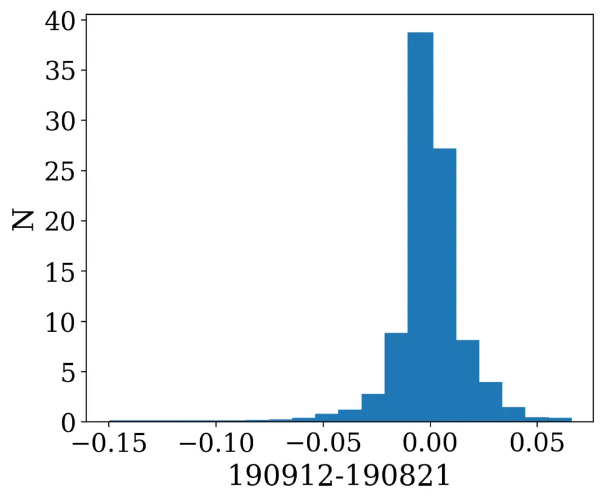

Observations & Processing
=========================

Released Observations
########################
All raw observational data from the imaging surveys through the first year of survey observations (1 July 2019 - 30 June 2020) are released. The survey medium-deep observations during this period were focused on  the Perseus-Pisces region, with an additional medium-deep field in the HETDEX region. The wide tier of the survey focused on the HETDEX region (for overlap with the LoTSS DR1), with additional coverage in the Herschel-ATLAS North Galactic Cap, and in the fall sky between 22h-0h. In total, there are 218 observations; 65 of these observations build repeated coverage of nine medium-deep fields. There are observations of 160 unique fields; with an effective field-of-view (based on spacing between fields) of 6.44 square degrees, the released observations cover just over 1000 square degrees of sky.

:numref:`dr_year1_apercal_processing_obs` shows the sky coverage of released observations, with the full four-year survey footprint shown for reference. The color coding indicates the version of the pipeline used for processing (see "Apercal versions applicable to the release" for details), where "None" means no processing was performed (see "Notes on specific observations"). "AMES" refers to observations in the medium-deep footprint, and :numref:`dr_year1_apercal_processing_ames` shows these repeated medium-deep fields separately as individual observations of a field may be processed by different versions of the pipeline.

.. figure:: images/dr_year1_apercal_processing_obs.png
  :align: center
  :width: 400
  :alt: Relative flux error
  :name: dr_year1_apercal_processing_obs

  The sky coverage of released observations, with the full four-year survey footprint shown for reference. The color coding indicates the version of the pipeline used for processing (see "Apercal versions applicable to the release" for details).

   A view of the processing for medium-deep fields with repeat visits. The observations are ordered in time-order and the color code refers to the same processing as for the figure above.

Notes on the data quality/processing  for specific observations can be found here.

A machine-readable summary table of these observations can be exported using the VO infrastructure, more details are provided in section “User Interfaces”.

Primary Beam Response
#########################

Overview of primary beam shapes for Apertif
---------------------------------------------

Knowing the primary beam shape of a radio telescope is critical for deriving accurate fluxes away from the beam center. In the case of PAFs, the primary beam response, also known as the compound beam shape, must be independently measured for each compound beam as they are not constrained to have the same shape. Generally, formed beams further from the pointing center of the PAF will have more elongated shapes.

Full characterization of the Apertif primary beam is ongoing work. In this documentation we describe the methods used to measure the compound beam shapes (drift scan measurements and Gaussian process regression); describe the first release of primary beam images and plans for near-term updates; and offer an initial characterization of these released primary beam images.

We wish to emphasize that the use of the classic WSRT primary beam correction is not appropriate for Apertif. In addition to the fact that the compound beams can have non circularly symmetric shapes (see :numref:`beams_chan`), the sizes of the primary beams are different from the classic WSRT. The Apertif front-ends fill the focal plane more efficiently than the old MFFE frontends, leading to a smaller primary beam shape. :numref:`dif_oldwsrt` shows one set of measured compound beam shapes divided by the classic WSRT primary beam shape. In addition to the elongated shapes (and offsets) visible in outer beams, the Apertif primary beam value is generally smaller than the classic WSRT primary beam value, confirming the smaller primary beam shape for Apertif.

.. figure:: images/190912_beams_chan_7-1-1024x990.png
  :align: center
  :width: 400
  :alt: Relative flux error
  :name: beams_chan

  Beam maps for all 40 apertif beams reconstructed from drift scans. Contour levels are: 0.1, 0.2, 0.4, 0.5, 0.6, 0.8. Red contours highlight the 10% and the 50% sensitivity level. These drift scans were measured in September 2019 and channel 7 corresponds to a frequency of ~ 1.363 GHz.

   Compound beam shapes derived from drift scans divided by the classic WSRT primary beam. Contours are: 0.2, 0.4, 0.6, 0.8, 1.0.

Drift scan method
------------------
Beam maps are produced from drift scans performed periodically on Cygnus A (CygA hereafter). Cyg A is chosen for the drift scans since it is one of the brightest compact radio sources in the northern sky, with a brightness of 1589 Jy (Birzan et al. 2004) an extent of approximately 5′ at 1.4 GHz, which makes it an unresolved continuum source for a single WSRT dish. During the drift scan measurement the PAF is at a fixed position on the sky and Cyg A drifts through the field of view in a straight line. The separation between the drifts is 0.1 degrees in declination. This is then repeated 31 times to cover the whole field of view of the 40 Apertif beams. :numref:`drift_scan_CygA` illustrates this process.

Drift scan observations are scheduled using the aperdrift code : https://github.com/kmhess/aperdrift

.. figure:: images/CygA_driftscan-1024x697.png
  :align: center
  :width: 400
  :alt: Relative flux error
  :name: drift_scan_CygA

   Illustration of drift scan observations. The dots represent the beam centres of the 40 Apertif beams, and the lines represent individual drifts across the field of view of the Apertif footprint.

Beam models
^^^^^^^^^^^^^^
The auto correlation data from the drift scans is used to construct fits images of each beams response to Cyg A. Then we perform a 40 times 40 pixel spline interpolation for each beam to minimise the distorting effect of bad data (e.g. RFI) to the beam map. For this, we use the scipy package interpolate.RectBivariateSpline, which performs a bivariate spline approximation over a rectangular mesh to smooth the data.

Once the fitting is done, we write out the resulting beam maps into a csv table and also into 9 times 40 fits files corresponding to 9 frequency bins for all 40 beams.

We divide the 150 MHz bandwidth into 10 frequency bins when extracting the auto correlation data from the drift scans. From these we construct beam models at 9 different frequencies (chan 1-9). We do not use the first frequency bin (chan 0) because it is always badly affected by RFI.

The code to produce the beam maps is available at: https://github.com/apertif/aperPB

.. figure:: images/190912_beams_chan_7-1-1024x990.png
  :align: center
  :width: 400
  :alt: Relative flux error
  :name: beams_chan

  Beam maps for all 40 apertif beams reconstructed from drift scans. Contour levels are: 0.1, 0.2, 0.4, 0.5, 0.6, 0.8. Red contours highlight the 10% and the 50% sensitivity level. These drift scans were measured in September 2019 and channel 7 corresponds to a frequency of ~ 1.363 GHz.

Time variability
^^^^^^^^^^^^^^^^^

Beam weights are measured at the start of every imaging observing run and are typically used for 2 weeks in a row. The beam weights define the shape of the compound beams. They depend on the quality of the beam weight measurement, (e.g. RFI at the time of the measurement) and also on the health of the system (e.g. broken elements on the PAFs, dysfunctional antennas). Drift scans are typically measured once per month due to the time intensive nature of the measurement. The beam models derived from drift scans observed at different times typically vary by a few percent (rms of the difference).

  Normalised distribution of the pixel by pixel difference between beam maps observed in September 2019 and in October 2019. The rms of the distribution is 0.018.

Beam size change with frequency
^^^^^^^^^^^^^^^^^^^^^^^^^^^^^^^^^^^
Beam shapes and sizes change across the field of view of Apertif with the central beams being more symmetric and the beams along the edge of the field of view more elongated. :numref:`chann_9` and :numref:`chann_7` show the average beam size (FWHM), and the FWHM along the x and y axis as a function of beam number. :numref:`chann_9` shows the beam size for frequency bin 7 (1.363 GHz) and :numref:`chann_7` shows the same for frequency bin 9 (1.399 GHz).

.. figure:: images/190912_chann_9_FWHM-1024x706.png
  :align: center
  :width: 400
  :alt: Relative flux error
  :name: chann_9

  FWHM as a function of beam number for channel 7 (1.363 GHz). The black line shows the average FWHM when fitting a 2D Gaussian function to the beam maps. The blue line shows the FWHM of the 2D Gaussian along the x-axis (r.a.) and the orange line shows the FWHM along the y-axis (dec). The shape of the CBs is not perfectly Gaussian, but a 2D Gaussian function is a good approximation for the beam shapes within a few percent.

.. figure:: images/190912_beams_chan_7-1-1024x990.png
  :align: center
  :width: 400
  :alt: Relative flux error
  :name: chann_7

  FWHM as a function of beam number for channel 9 (1.399 GHz). The black line shows the average FWHM when fitting a 2D Gaussian function to the beam maps. The blue line shows the FWHM of the 2D Gaussian along the x-axis (r.a.) and the orange line shows the FWHM along the y-axis (dec).

Beam sizes change linearly with frequency. The frequency dependence is on average: -2.108e-08 · freq [Hz] + 63.47. This is based on fitting a 2D Gaussian to each beam map at each frequency, taking the average FWHM from the 2D Gaussian fit and then fitting a first order polynomial to the FWHM vs. frequency for each bin. The results were then averaged for 14 different drift scan measurements. :numref:`size_freq` shows the average beam size for each 40 beams as a function of frequency bin for a set of drift scans (grey lines). The dashed black line shows the average fitted line to the data. Some of the beams occasionally show non smooth variation with the beam size (for example beam 7, see also in :numref:`chann_9`and :numref:`chann_7`). The cause for this in most cases is due to the effect of RFI in certain frequency bins.

  FWHM of CBs as a function of frequency bins. We divide the 150 MHz bandwidth into 10 frequency bins when constructing the CB maps. The grey lines show the average FWHM from the 2D Gaussian fit to each CB, while the dashed black line shows the average fitted line (a and b are the parameters of the line).

Gaussian process regression
------------------------------

A second method for measuring the compound beam (CB) shapes uses a comparison of the continuum images to the public NVSS catalog and Gaussian process regression (GPR) to construct the compound beam shape.

The Apertif images of each individual compound beam (CB) are convolved with a circular PSF of 45" to match the NVSS resolution. Then the source finding is performed, and the list is cross-matched with the NVSS catalog. After that the distribution of the relation between NVSS and Apertif total flux  e=SAPERTIF/SNVSS over a CB field of view is considered. In the absence of any biases it represents the corresponding compound beam shape.

An example of this relation is shown in :numref:`gauss`. The top left plot shows the distribution of 7153 sources over Beam 01 observed from August 2019 to June 2020. The size of each symbol corresponds to the fraction e.

All the data for a given CB (40+ epochs, a few thousands cross-matched sources) is considered and the scikit gaussian_process python library is used to construct a gaussian process regression for these data. For that, the mean value is subtracted from the data. The kernel for GPR is chosen as a sum of two squared exponentials and the one representing white noise. The first kernel represents the main CB shape, and the second one represents shorter scale irregularities. After the gaussian process is trained the regression surface is obtained. The surface is then normalized to take values between 0 and 1. An example of the GPR for Beam 01 is shown in the top right panel of :numref:`gauss`.

With this method the “average” CB shapes over the span of all observations are obtained. We note, nowever, that the shape of a CB can change in time because of re-measurement of the beamweights, broken/repaired PAF elements, or if a particular antenna is excluded from observation.

In order to address concerns about time-variability, the described method allows one to obtain the CB shape for a given observation, using only measurements obtained within a given beamweights set (usually a two week time span). Typically, around 500 cross-matched sources (5 - 7 observations) are needed to  build the GPR accurately.

These all-antenna CB models correspond to the middle frequency of the 150 MHz band  and can be scaled further to be used for the HI or polarization cubes.

.. figure:: images/fig1-1-1024x752.png
  :align: center
  :width: 400
  :alt: Relative flux error
  :name: gauss

  Top row -- the total flux ratio of APERTIF to NVSS and the corresponding GPR. Bottom row -- the GPR middle slices along RA and Dec.

Released primary beam images
--------------------------------

The initial primary beams to accompany the first data release are those derived from the Gaussian process regression (GPR). The flux ratios between NVSS and Apertif were examined for both the compound beams derived from GPR and the drift scan methodology (see "Characterization of the primary beams"). Both sets of compound beams show similar behavior in the inner region, but the primary beam images from the drift scan methodology show systematics in the outskirts of the primary beam response, likely related to source confusion when performing the drift scans. This is under active investigation but currently only the GPR compound beam shapes are released as these appear to behave better in the outer regions.

These primary beams are appropriate for the center frequency of the continuum images, 1361.25 MHz, over the frequency range 1292.5-1430 MHz. The drift scan measurements demonstrate the size of the compound beam changes linearly with frequency, as expected.

The provided primary beam images are created at 100” resolution and should be regridded to match the images/cubes they are used to correct. In addition, they can be applied to other frequencies by scaling the cell size (cdelt1 and cdelt2 keywords) linearly with frequency (see subsection "Beam size change with frequency" in "Drift scan method" for the scaling) before regridding to match the data product of interest.

Two sets of primary beam images are released for each compound beam. The first set (“orig”) is not normalized to have a peak response 1. By construction, applying these primary beam images to the Apertif data should result in measured fluxes that are consistent with those in the NVSS catalog. Note, however, that the derivation of the primary beam response images did not account for the slightly different center frequency of the Apertif continuum images (1361.25 MHz) compared to NVSS and thus there may be small changes in the flux scale due to spectral indices of sources (2% for a typical spectral index of -0.7).

The second set (“norm”) are primary beam images normalized to have responses between 0-1, as is typical for primary beam images.  Applying these primary beam images to the Apertif data will include systematic offsets between the measured Apertif fluxes and the NVSS catalog fluxes; this is discussed and quantified in "Characterization of the primary beams".

Characterization of the primary beams
----------------------------------------

In order to provide information on the reliability of the measured primary beam images, we undertake an empirical comparison to the NVSS catalog over the full data release. While similar in philosophy to the Gaussian process regression used to derive the primary beam images, this comparison provides information about overall systematics in the flux scale, in addition to quantifying the scatter in the accuracy of derived fluxes using the provided primary beam images. It also allows a direct comparison between the reliability and accuracy of primary beam images derived from different measurement techniques.

Briefly, in order to provide a comparison over the full data release, the following steps are taken for every continuum image in the data release:

* Convolve the Apertif continuum image to 45″ resolution
* Regrid the primary beam image to the Apertif continuum image
* Primary beam correct the Apertif image (mask below 10% response)
* Create an Apertif source catalog by running pybdsf; identify sources with S/N > 5
* Cross-match to the NVSS catalog

The cross-matches are recorded and later combined to build a global picture of a compound beam over the full data release.

The key value examined to understand and characterize the primary beam response images is the ratio of the Apertif integrated flux over the NVSS integrated flux. The first check was to look for systematics in this value as a function of position, since this could point to biases in the derivation of the primary beam responses. The primary beam images constructed from drift scans resulted in systematically higher flux ratios at the outskirts of the primary beam response in a consistent (south-west) direction for all compound beams. This points to an issue with source confusion around Cyg A which is under active investigation. This systematic was not seen in the primary beam images derived with the Gaussian process regression.

The key characterization of the primary beam images is to understand the impact they have on the flux scale. Flux validation of continuum images takes an initial look at this using a single medium-deep field to look at the internal consistency of the flux scale and compare to NVSS. With the full primary beam characterization, this can be examined for each compound beam in aggregate over the full data release. While the originally returned primary beam images from the Gaussian process regression match the NVSS flux scale by construction, it is informative to undertake the comparison for the normalized primary beam images as this provides information about any overall differences in the flux scale between Apertif and NVSS (which would also be seen in primary beam images derived from the drift scan approach). Cross-matched sources were filtered to have a deconvolved major axis in the NVSS catalog < 45” and to have a measurement error on the ratio of integrated fluxes between Apertif and NVSS <0.1. Table 1 provides (as a csv file) the median ratio between the integrated fluxes, along with the standard deviation of the flux ratios and the median measurement error on the flux ratio. Table 2 provides (as a csv file) these same values but limited to the inner part of the primary beam images where the response level is ≤50%. The typical value is 1.11 in both regimes, indicating the Apertif fluxes are systematically ~10% higher than those from the NVSS catalog. The Apertif fluxes are expected to be ~2% higher based on a typical spectral index of -0.7 and the difference in center frequency in between Apertif and NVSS. In addition, the NVSS integrated fluxes are catalog flux values, corrected for various biases, while the Apertif integrated fluxes are measured directly from the images and may include calibration and clean biases. This will be examined in more detail in the forthcoming data release paper (Adams et al., in prep).

Table 1 and 2 also include the standard deviation of the flux ratios for each compound beam. These values are rather large, typically ~16-17%. This does not indicate an uncertainty in the primary beam measurement at this level as there are several contributing factors. The typical measurement uncertainty is ~5%, and intrinsic source variability is on the order of ~10% (e.g., Hovatta 2009). The data release paper will undertake an accounting of all sources of scatter to quantify what the uncertainty on the flux scale from primary beam variability might be. In addition, the internal consistency of flux measurements for all medium-deep observations in the data release will be undertaken to provide an additional handle on the accuracy of the flux scale within the Apertif datasets.

Table 1: Median ratio of Apertif/NVSS integrated flux, standard deviation of flux ratio, and median measurement error of flux ratio over the full Apertif primary beam (to 10% level)
::download:`content/Table-1-Median-ratio-of-Apertif-NVSS-integrated-flux.csv`

Table 2: Apertif/NVSS integrated flux, standard deviation of flux ratio, and median measurement error of flux ratio over the inner Apertif primary beam (≥50% level)
::download:`content/Table-2-Median-ratio-of-Apertif-NVSS-integrated-flux.csv` Median ratio of
