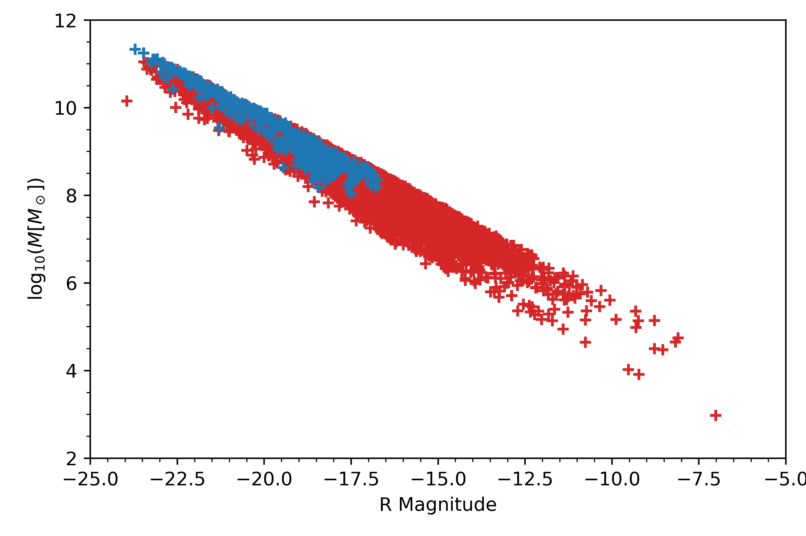

=============================================================================
Comparing the SFR-Luminosity relations of the Millennium Simulations and SDSS
=============================================================================

:Author: Celestin Herbe-George

.. role:: raw-latex(raw)
   :format: latex
..

Introduction
============

Galaxy formation modelling is one of the most important and heavily
researched areas of Cosmology. Today, there exist many different models
that attempt to predict the observations of galaxies in our universe but
one model that has shown to be the most popular is the Lambda-CDM model.
In 2005, the Virgo Consortium, an international collaboration, ran a
high-resolution N-body simulation of the Lambda-CDM model
:raw-latex:`\cite{MSim}`. This simulation, the Millennium Simulation,
has arguably provided the most important theoretical data for the model,
enabling critical comparisons with the observations to be made.

The Sloan Digital Sky Survey (SDSS) is an optical telescope that has
been carrying out imaging and spectroscopic surveys of the sky since
2000. The SDSS data is ideal data to compare the Millennium Simulation’s
prediction with as it covers a wide range of redshifts, probing deep
into the evolutionary history of the universe. Furthermore, SDSS has
observed and recorded the redshift and spectra of over 1 million
galaxies meaning significant statistical comparisons and conclusions can
be made.

Star formation rates (SFR) are key in the study of galaxies, defining
their visible properties. As outlined by Kennicutt, SFR can be strongly
influenced by not only the morphology of the galaxy but also by the gas
content, mass, bar structure and dynamical environment
:raw-latex:`\cite{Ken}`. This makes an investigation of the SFR
determined in the Millennium Simulation a key probe in the validity of
theoretical model. Similarly, the mass-to-light ratio (M/L) is vital in
determining the dynamics of a galaxy from photometric observations and
shall also be investigated :raw-latex:`\cite{deJong}`.

Results
=======

Theoretical predictions
-----------------------

Firstly, the snapshot number for the data acquisition had to be
determined as each snapshot of the simulation corresponds to a different
redshift. Through a simple query, it was found that :math:`snapnum = 59`
was the snapshot that had a redshift closest to 0.1 (this snapshot had a
redhsift of 0.089). Then a query was written to select the following
properties of 10 000 galaxies: SFR, stellar mass, bulge mass and the B,
V, R band magnitudes. These were queried from the DeLucia2006a database
as this is a database of galaxies and is shown in figure
`[fig:millQuery] <#fig:millQuery>`__.

::

   [
     linewidth = 6.5cm,
              language=SQL,
              showspaces=false,
              basicstyle=\ttfamily,
              numbers=left,
              numberstyle=\tiny,
              commentstyle=\color{gray}
           ]
   SELECT TOP 10000 sfr,
   stellarMass, mag_b,
   mag_v, mag_r, redshift,
   bulgeMass
   FROM millimil..DeLucia2006a
   WHERE snapnum = 59
   AND mag_r != 99.0

::

   [
               % linewidth = 5.5cm,
              language=SQL,
              showspaces=false,
              basicstyle=\ttfamily,
              numbers=left,
              numberstyle=\tiny,
              commentstyle=\color{gray}
           ]
   SELECT TOP 10000 s.SpecObjID,
   s.z, dbo.fCosmoDl(s.z),
   s.fiberMag_r, L.height, L.sigma,
   L.wave, L.restWave
   FROM SpecPhoto as s
   JOIN SpecLine as L
   ON s.SpecObjID = L.specObjID
   WHERE ObjType = 0
   AND L.LineID = 6565
   AND abs(s.z-0.1) < 0.011
   AND L.height >0000

The stellar mass was then plotted against the absolute r-magnitude as
shown in figure `1 <#fig:logmass>`__. In order to investigate the
mass-to-light ratio discussed in the Introduction, the r-band luminosity
in solar units was computed for the each galaxy in the sample using

.. math:: L_r/L_\odot = 10^{-0.4(M_r - M_{\odot,r})} \label{eq:L},

where :math:`M_r` is the absolute r-magnitude of the galaxy,
:math:`M_{\odot,r}` is the absolute r band magnitude of the Sun and is
:math:`M_{\odot,r} = 4.76`. Bell & de Jong present a popular relation
for the mass-to-luminosity ratio which is
:math:`M/L = -0.565 + 1.132(B-V)`. However, this fit was found by using
a sample of spiral galaxies. To enable a direct comparison to be made,
the spiral galaxies within the Millennium Simulation sample needed to be
found. A quantitative description of a spiral galaxy is still heavily
debated but a popular method is to use the bulge mass to total mass
ratio, :math:`B`, of the galaxy :raw-latex:`\cite{bulge}`. By using the
somewhat strict threshold that a spiral can be defined as having
:math:`B < 0.66`, the sub sample of spiral galaxies can be found. Both
the full sample and sub sample where fitted using a linear least squares
fit yielding parameters :math:`a = 1.223` and :math:`b = -1.161` and
:math:`a_s = 0.965` and :math:`b_s = -0.960` respectively. Here
:math:`a` denotes the gradient and :math:`b` the intercept and the
subscript :math:`s` the spiral sub sample. This spiral sub sample was
also applied to figure `1 <#fig:logmass>`__.

.. figure:: images/M_L.pdf
   :alt:

[fig:M_L]

Observational data and SFR
--------------------------

The SDSS data was queried from CasJobs in a similar manor to the
Millennium Simulation data. 10 000 galaxies were selected. Unlike the
Millennium Simulation, the star formation rates are not readily
available for the observational data. To find the SFR, a relationship
found by the calibration of evolutionary models can be used. The query
is shown in figure `[fig:sdssQuery] <#fig:sdssQuery>`__. Kennicutt
presents such a relationship that makes use of the H\ :math:`_\alpha`
recombination line. Recombination lines are able to probe the SFR as the
luminosity of young stellar populations are re-emitted by nebular lines
towards the H\ :math:`_\alpha`, H\ :math:`_\beta`, P\ :math:`_\alpha`,
P\ :math:`_\beta`, Br\ :math:`_\alpha` and Br\ :math:`_\gamma` lines.
The calibrated relationship used here is

.. math:: \mathrm{SFR [M_\odot/yr]} = 7.9 \times 10^{-42} L(H_\alpha)\mathrm{ [ergs/s]},

where :math:`L(H_\alpha)` is the :math:`H_\alpha` luminosity for a
source :raw-latex:`\cite{Ken}`. For a source at redshift z the
:math:`H_\alpha` luminosity can be found using
:math:`L(H_\alpha) = F\cdot 4\pi d^{2}_L`, where :math:`F` is the flux
and :math:`d_L` the luminosity distance. The latter can be returned by
the query whereas the flux can be found through
:math:`F = \int A\exp{\frac{-(\lambda - \lambda_0)^2}{2\sigma^2}} = A\sqrt{2\sigma^2\pi}`,
where :math:`A` is the height of the line and :math:`\sigma` the width
of the line, both of which can be found in the SDSS database.

Finally, the absolute r band magnitude was found using the well known
distance modulus equation,
:math:`M_r = m_r - 25 -5\log_{10}(d_L(z)/MPc)` where :math:`m_r` is the
apparent r band magnitude and :math:`d_L` is the luminosity distance in
MPcs. Note special attention to the units used by SDSS is required.
Using the absolute magnitude and equation (`[eq:L] <#eq:L>`__) the r
band luminosity can be found. The SFR was then plotted against the r
band luminosity and is shown in figure `2 <#fig:SFR>`__.

.. figure:: images/SFR.pdf
   :alt: The star formation rate against the r band luminosity for 10
   000 galaxies from both the Millennium Simulation data (blue) and the
   SDSS observational data (orange).
   :name: fig:SFR

   The star formation rate against the r band luminosity for 10 000
   galaxies from both the Millennium Simulation data (blue) and the SDSS
   observational data (orange).

Discussion
==========

Figure `1 <#fig:logmass>`__ shows that there is a clear trend between
the Mass of the galaxy and the r band magnitude. The brighter the
galaxy, the heavier it is. This is the overall trend found in
literature. There seems to be a better fit for brighter galaxies, where
the data points are more concentrated but this quickly evolves into a
wide band as the magnitude becomes more positive. Furthermore, the
sample that were deemed to be spiral galaxies seems to be significantly
brighter. This is surprising as one would expect the spiral galaxies to
be distributed somewhat evenly amongst the magnitudes. This suggests
that the criteria used to determine which are spiral galaxies may be
incorrect. One possible error could be that all galaxies that had a
bulge mass = 0 were removed from the spiral sample as these were
interpreted to be other galaxy types where the bulge is harder to define
(such as Ellipticals). Further investigation into how the Millennium
Simulation determines this bulge mass would be required for a more
strict and confident definition of spiral galaxies.

| Figure `[fig:M_L] <#fig:M_L>`__ provides a more quantitative
  evaluation of the theoretical simulations. The gradient and intercept
  of linear least squares fit for the whole sample was found to be
  within 8% and 105%, respectively, of the one presented by Bell & de
  Jong. The fit for the spiral galaxies was within 15% and 70%. The
  gradient of the whole sample does seem to be in agreement with Bell %
  de Jong, whereas the difference in intercept suggests a systematic
  error. Bell & de Jong did fit the data with a cosmology where
  :math:`H_0 = 71` km/s/MPc whereas the fit presented here uses a
  cosmology where :math:`H_0 = 70` km/s/MPc, this difference would
  indeed change the intercept but not the gradient. Furthermore, they
  derived the relation using spiral galaxies, therefore using a sample
  of all galaxy types is bound to introduce some discrepancies. It is
  then surprising that the spiral sub sample does not agree more with
  the literature, only the intercept is marginally closer. This again
  suggests that the spiral sub sample selection criterion is incorrect.
  Overall, the mass to luminosity ratio plot found here does suggest
  that the theoretical models are in agreement with the observations.

Finally, figure `2 <#fig:SFR>`__ shows SFR against r band luminosity for
the Millennium Simulation and SDSS data. The Millennium Simulations has
a significantly higher scatter in the luminosity direction than the SDSS
data, this could be due to the simulations over predicting low
luminosity low SFR galaxies. This would be due to a problem with the
lambda-CDM model and could stem from the challenges the model already
faces such as over predicting dwarf galaxies. This was deemed to
complicated to investigate in the available time frame.

Another, more convincing, explanation for the difference in luminosity
scatter could be that the SDSS data is suffering from a selection bias.
As discussed in :raw-latex:`\cite{ext}`, if the young stars are within
or behind clouds of gas and dust, their light will be absorbed and
re-emitted at longer wavelengths (such as IR). Young stars are likely to
lie within these regions as these are the star forming regions of
galaxies. This makes this selection bias a very convincing hypothesis
for the difference in scatter. To confirm this hypothesis, one could use
the IR luminosity and calibrate the SFR. Unfortunately this could not be
investigated further due to time constraints.

The two data samples do have a significant overlap, which could indicate
that the Millennium Simulation correctly predicts a certain population
of galaxies that are observed by SDSS. Due to the large scatter, no fits
were fitted. One can still notice a slight trend in the Millennium
Simulation data, where the more luminous galaxies have higher SFR. The
SDSS data hints at a similar trend but nothing more can be said about
this. Both data sets do show a similar scatter in the SFR direction,
providing further agreement between the theoretical simulations and
observations.
