Where to find the Data
=======================

User Interfaces
#####################
The Apertif Data Release 1 (Apertif DR1) is hosted on the Apertif Long Term Archive and exposed to the community through the standard Virtual Observatory protocol. This section describes how the Apertif DR1 data products can be queried and accessed by using different applications.

Introduction
****************
The science-ready data products as described in Overview (see Available Data Products and Released processed data products), are exposed through standard Virtual Observatory protocols to facilitate their access and exploration.

The Apertif DR1 data is hosted on the Apertif Long Term Archive (ALTA) system. We recommend astronomers to use the VO interfaces described below for data discovery. These interfaces will redirect to ALTA file servers for data access where appropriate.

In particular, the protocols offered are the Tabular Access Protocol (TAP), Simple Application Messaging Protocol (SAMP) and the Simple Image Access protocol (SIA). TAP and SAMP enables queries to explore the data in a tabular form using tools such as TOPCAT. TOPCAT is an interactive graphical viewer and editor for tabular data, it enables the interactive exploration of large tables performing several types of plotting, statistics, editing and visualization of tables. SIA enables the rapid display of images and cubes through all sky atlas tools such as ALADIN. ALADIN is an interactive sky atlas allowing the user to visualize digitized astronomical images/cubes and superimpose entries from astronomical catalogues or databases.

The data published in the VO  can also be accessed using a web browser at https://vo.astron.nl. This web interface provides a page on which all the collections present in the registry are listed, including the published Apertif DR1 data sets (:numref:`col_page`).

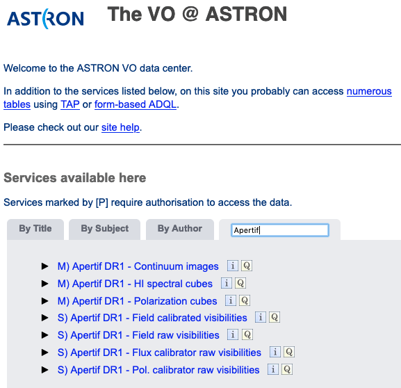

  ASTRON VO interface.

Selecting a data collection allows the user to perform a cone search through a webform (:numref:`query_search`) for all data products of that given class overlapping a given pointing. The size of the continuum images as well as the cubes extend beyond the 10% primary beam level for cleaning the secondary lobes of bright offset sources. To ensure that the search is done in the area of maximum sensitivity the search is performed on a maxim radius of 0.75 degrees from the center (this represents the  average value of where the sensitivity drops). This value can be modified using the Max distance from center. A different output with respect to the default can be customized using More output fields selection button.

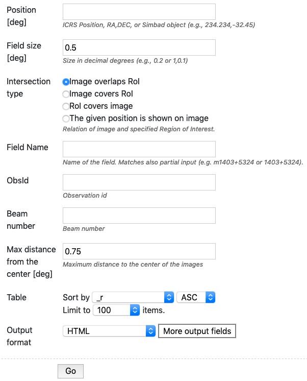

  Query search form for continuum images.

The result is a table in the requested output format in which every row corresponds to a data product (:numref:`dataProd`).

In each row there is a column, Product key, which is a link that allows the user to download the fits file of the image or the cube of interest.

The selected target and the position of the individual beams can be visualized using the Quick plot button at the top of the window of the results of the search query (:numref:`dataProd`).

In the column Related products another link connects to a page containing a list of links to additional related data that can be useful to interpret or reanalyze that given product (e.g. primary beam images), for which a preview is provided (:numref:`rel_prod`).

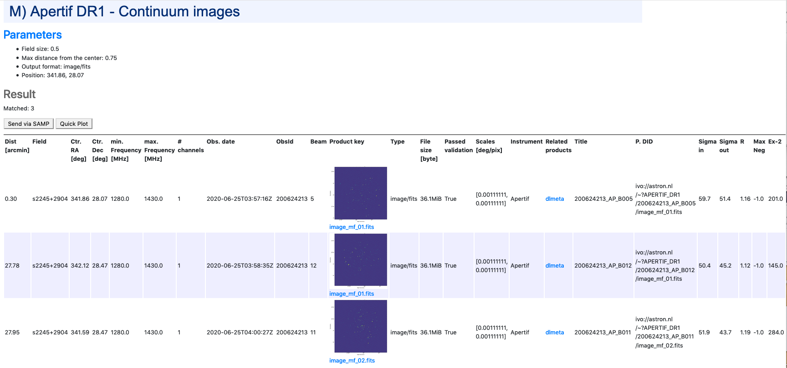

  Result of the search query. Click for a bigger image.

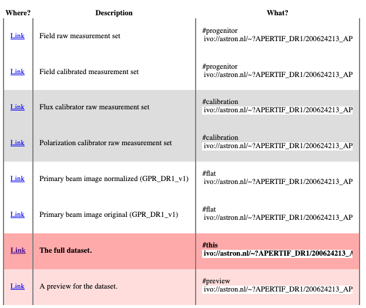

  Links of ancillary data products related to the target of interest. Click for a bigger image

The columns shown in Figure 3 are the most informative for the astronomers (e.g. position, observing frequency, observing date, quality assessment, format etc), please note that more columns are available but not displayed here. The complete set of columns can be visualized via topcat as described below or using More output fields selection button in the search query. Querying the released data is also possible using e.g. TOPCAT using TAP. Via the TAP protocol, it is possible to query the registry in a more flexible way using an enriched SQL syntax called ADQL. An example is given in :numref:`ADQL_query` : click the link indicated with the red ellipse on the left panel Try ADQL and place your ADQL query on the query form.

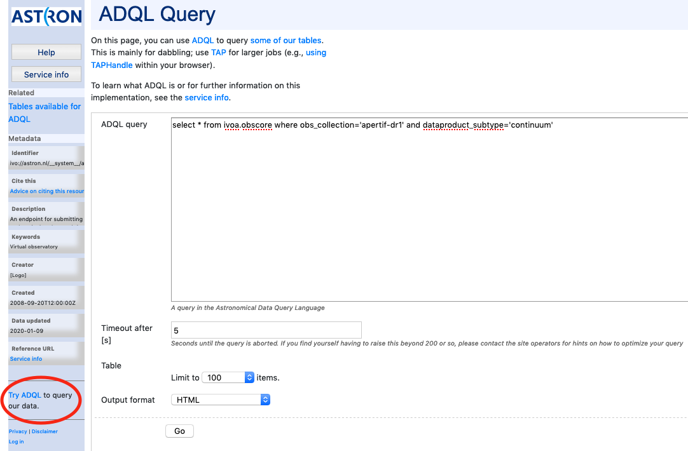

 ADQL query form.

The table names to use in the query form of :numref:`ADQL_query`, are summarized in :numref:`ADQL_table`. The URL  for the query is then: https://vo.astron.nl/apertif_dr1/q/{Table name}/form (e.g. http://dop457.astron.nl:5555/apertif_dr1/q/apertif_dr1_continuum_images/form}.

It is possible to query all the available dataproducts at once by using the table ivoa.obscore and by appending to the ADQL statement "where obs_collection=" it is possible to limit the search to the apertif_dr1 only.

VO-Apertif DR1 Processed Data Products
****************************************

.. csv-table:: Table names to be used in the ADQL query.
  :align: center
  :header: "Table name", 	"obscore type", 	"obscore subtype"
  :widths: 20, 20, 20
  :name: ADQL_table

  apertif_dr1.continuum_images,  	image, 	continuum
  apertif_dr1.pol_cubes,  	cube,  	polarization cube
  apertif_dr1.spectral_cubes,  	cube,  	spectral cube
  apertif_dr1.beam_cubes, 	cube,  	dirty beam

Access via TOPCAT
*********************
The Apertif DR1 data collection tables can be accessed using TOPCAT, an interactive graphical viewer and editor for tabular data. The data can be sent from vo.astron.nl to TOPCAT using one of the two protocols: SAMP or TAP. The two subsections below provide a description on how to access the tabular data using either SAMP(link to Send via SAMP subsection) or TAP(link to VO Table Access Protocol (TAP) subsection).

Send via SAMP
---------------
With TOPCAT opened, and once you are satisfied with the output of the cone search in the Astron VO webform, click the grey button “Send via SAMP” as shown on the top of the output list of  Figure 3. Authorize the connection and wait until the download is completed.

Once completed, the catalogue will be visible in the left panel of TOPCAT (Table List). Click on the new entry as shown by the arrow in :numref:`topcat_list`. At this point the table browser will open showing the content of the DACHS results (PLACE HOLDER  use DR1 in selection).  From here any TOPCAT tool can be used for further inspection and analysis of the results. Alternatively the table can be saved in various formats and used locally with other programs (e.g. python scripts etc).

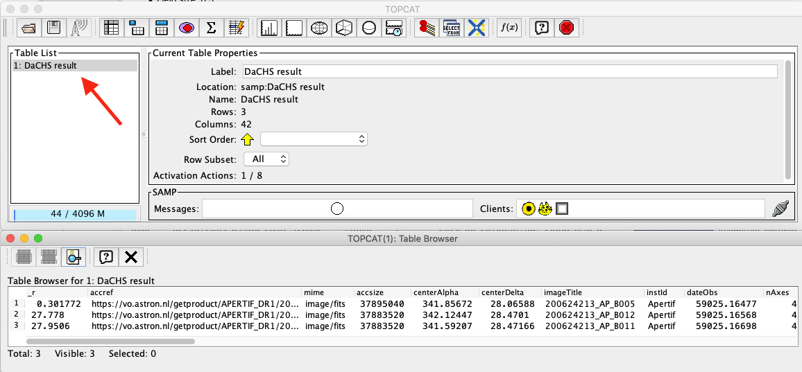

 TOPCAT table browser view of the Apertif DR1 data collection tables. Click for a bigger image.

VO Table Acess Protocol (TAP)
---------------------------------
From the TOPCAT menu bar, select VO and in the drop down, select Table Access Protocol (TAP) as shown by the red arrow in :numref:`VO_tap`.

This will open the Table Access Query window where the ASTRON VO TAP server is listed. Select it and click on Use Service at the bottom of the window (:numref:`VO_tap_astron`). Another tab will open showing the Apertif DR1 data collection. Select one, e.g. continuum image, and enter a query command in the bottom panel, an example of which is indicated by the red arrow in :numref:`VO_tap_dr1`. Submit the query using Run Query. This will show the resulting table in the Table list view shown before in :numref:`topcat_list`. From here, any TOPCAT tool can again be used. As mentioned in the previous section, the query result in vo.astron.nl will display a subset of the columns of the Apertif DR1 table (e.g. position, observing frequency, observing date, quality assessment, format etc). The complete set of columns (e.g. pipeline version, wcs references etc) belonging to each data collection of the Apertif DR1 can be explored using the option described in this section.

The position of the targets can be visualized using the option skyplot in TOPCAT, once the search query has been sent via SAMP or TAP as described in this section.

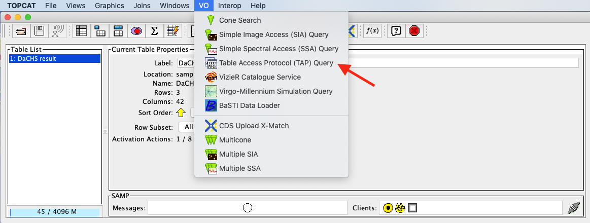

  TOPCAT menu bar for VO services. Click for a bigger image.

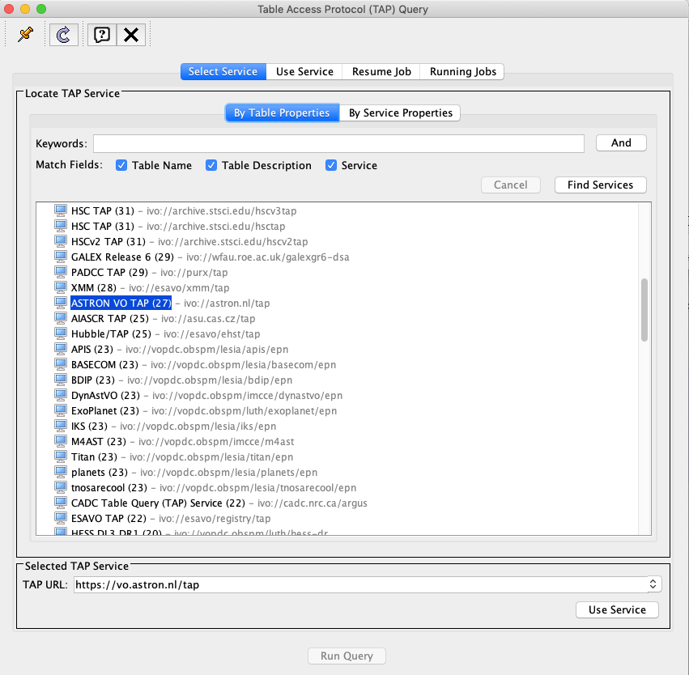

  TOPCAT TAP service query form. Click for a bigger image.

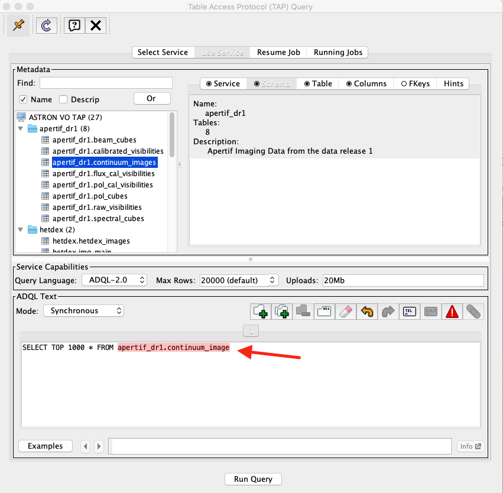

  TOPCAT menu bar for VO services. Click for a bigger image.

Another useful way to inspect the Apertif DR1 data collection, but also other data collections exposed via the ASTRON-VO, is the ivoa-obscore table. The same selection as before can be used (:numref:`VO_tap_dr1`) but instead of selecting Apertif_dr1 tables, the table ivoa.obscore is to be selected. In this way it is possible to glance over all the data collections exposed via the ASTRON-VO. This might be useful for instance to enable multi-wavelength science exploring LOTSS and Apertif DR1 data or, as mentioned in the case of the ADQL query, to visualize multiple data collections at once.

Having ALADIN open, and once you are satisfied with the resulting table, it can be sent to ALADIN following the instructions of :numref:`topcat_to_aladin`.

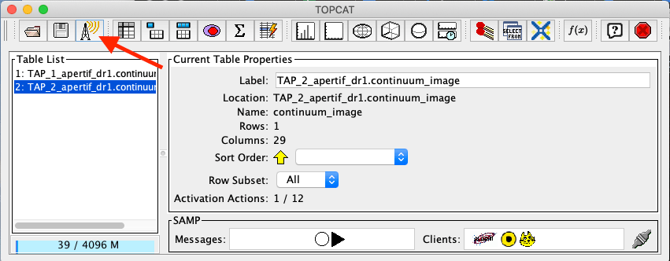

  How to transfer the TOPCAT query results to ALADIN. Click for a bigger image.

Access via ALADIN
********************
Catalogues
--------------

The Apertif DR1 VO data collection can also be discovered directly via ALADIN either via simple image access protocol (SIAP) or tabular access protocol (TAP). The examples shown here require the desktop version of ALADIN.

Open ALADIN and on the left panel for SIAP: select Others > SIA2 > astron.nl > The VO @ASTRON SIAP Version 2. Alternatively for TAP select Others > TAP > astron.nl > The VO @ASTRON TAP service (:numref:`coll_tap`). A pop-up window will open. Click load, and enter a query using the Server selector (:numref:`server_select`) or TAP access with astron.nl/tap (:numref:`search_tap`) to select the target of interest for SIAP and TAP respectively.

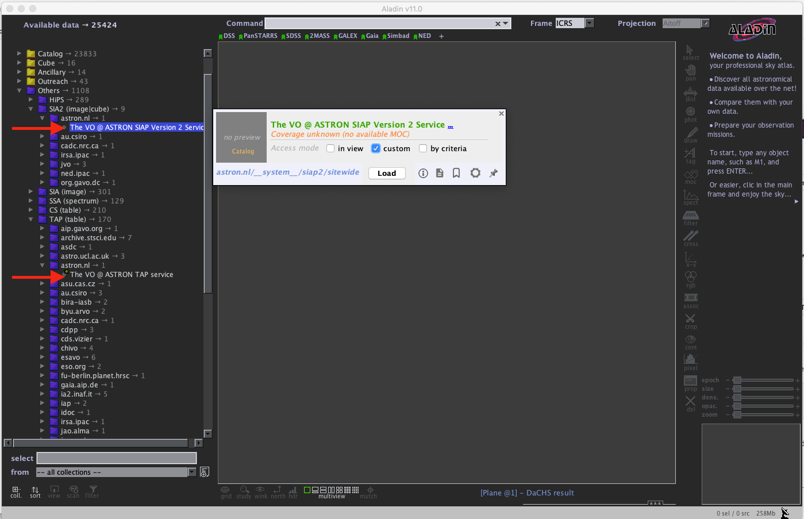

  ALADIN display panel. Click for a bigger image.

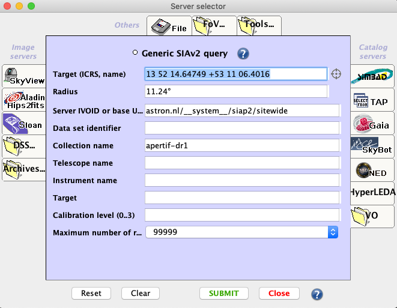

  ALADIN server selector panel for SIAP. Click for a bigger image.

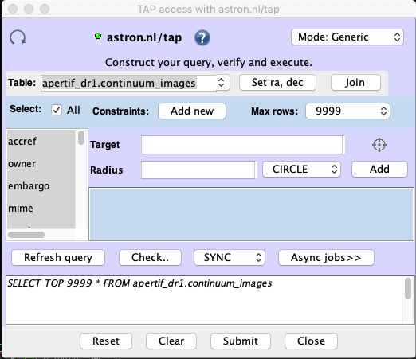

  ALADIN TAP access panel. Click for a bigger image.

After loading, the data collection catalogues can be plotted on the main panel by selecting them first on the right panel (e.g. highlighted in blue in Figures 14 and 15) and then by selecting the regions of interest on the bottom panel as shown in Figures 14 and 15. From here the usual functionality of ALADIN can be used.

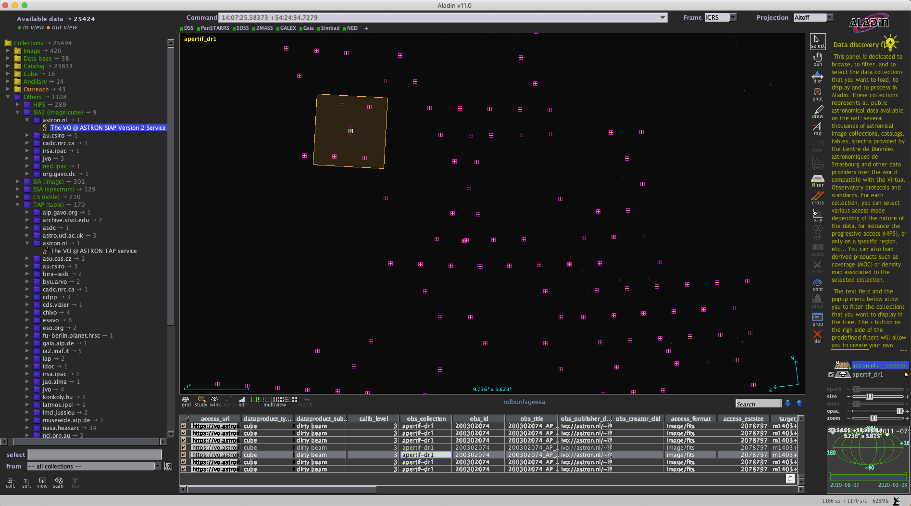

   Example of data collection selection via SIAP in ALADIN. Click for a bigger image.

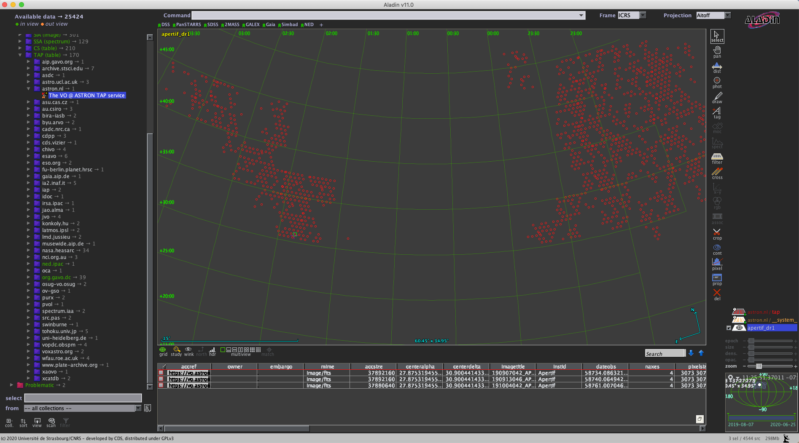

  Example of data collection selection via TAP in ALADIN. Click for a bigger image.

Images
--------
Downloading images or cubes in ALADIN is also possible (see :numref:`im_load_al`). The user will need to click on the url-link in the column access_url of the bottom panel. Then, once the image is loaded, click on the right panel as shown in :numref:`im_load_al`. From here the usual functionality of ALADIN can be used.

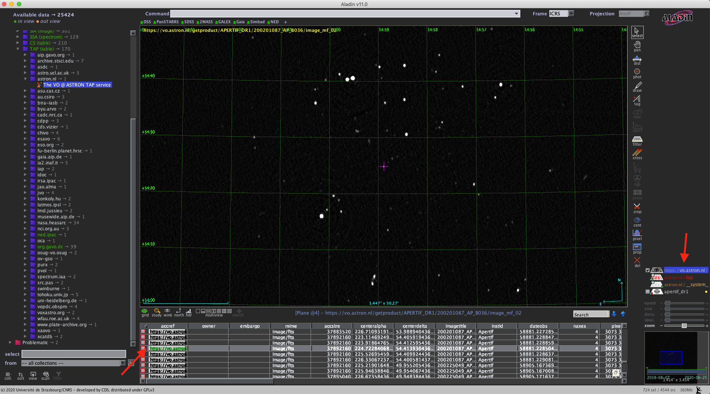

  Example of image selected from the Apertif DR1 displayed in ALADIN. Click for a bigger image.

Access to raw and calibrated visibilities
**********************************************
Raw observations and calibrated visibilities can be discovered in the data collection as shown in Figure 1, using the ASTRON-VO query form (Figure 2) or via TAP using TOPCAT.

In addition, the query results via ASTRON VO for continuum images, polarization images/cubes, and HI spectral cubes provides a link to ancillary data (:numref:`rel_prod`), including raw and calibrated visibilities.

These data products are stored on tape and not directly accessible for download, but until further notice access can be requested via the helpdesk (:numref:`helpdesk_req`). The request will be processed on a best effort basis. Within the same request also the calibration tables can be made available (see "Available data products").

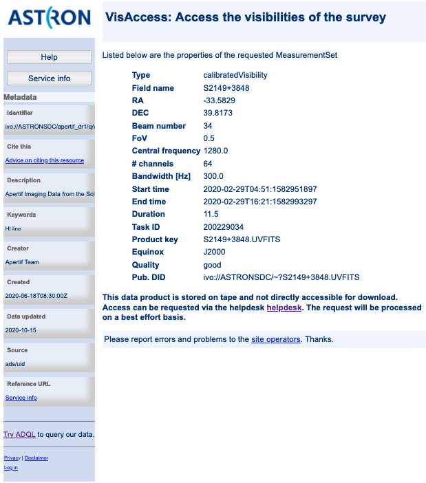

   Visibility data access page.

 .. figure:: images/helpdesk_req_vis_fig18.png
   :align: center
   :width: 400
   :alt: Relative flux error
   :name: helpdesk_req

   Astron help center webpage.

Primary beam images
---------------------

The continuum images, HI spectral cubes and V images and Q&U cubes are not primary beam corrected. Primary-beam images may be used for mosaicking or for correction of individual images. More information about the primary beam images for Apertif, including their derivation, can be found in the "Overview of primary beam shapes for Apertif."  Specifically, "Released primary beam images" describes the primary beam images initially made available as part of this data release. As for other ancillary data products, primary beam images can be found in the query results following the links in the column Related products (:numref:`ancillary_data`) for continuum images, HI spectral cubes or polarization cubes.

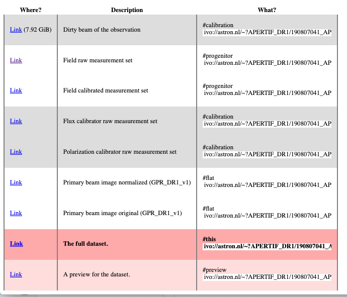

  Links to ancillary data. Click for a bigger image.

Python access
***************
The data collection and the table content can be accessed directly via python using the pyvo tool. Working directly in python the tables and the data products can be simply queried and outputs can be customized according to the user’s needs, without the involvement of TOPCAT or ALADIN.

An example of a TAP query and image download can be found in the python script below (it has been tested for python 3.7).  The result of the query can also be plotted using python.

.. code-block:: python

  #To start you have to import the library pyvo (it is also possible to use astroquery if you want)
  import pyvo

  ## To perform a TAP query you have to connect to the service first
  tap_service = pyvo.dal.TAPService('https://vo.astron.nl/__system__/tap/run/tap')

  # This works also for
  form pyvo.registry.regtap import ivoid2service
  vo_tap_service = ivoid2service('ivo://astron.nl/tap')[0]

  # The TAPService object provides some introspection that allow you to check the various tables and their
  # description for example to print the available tables you can execute
  print('Tables present on http://vo.astron.nl')
  for table in tap_service.tables:
   print(table.name)
  print('-' * 10 + '\n' * 3)

  # or get the column names
  print('Available columns in apertif_dr1.continuum_images')
  print(tap_service.tables['apertif_dr1.continuum_images'].columns)
  print('-' * 10 + '\n' * 3)

  ## You can obviously perform tap queries accross the whole tap service as an example a cone search
  print('Performing TAP query')
  result = tap_service.search(
   "SELECT TOP 5 target, beam_number, accref, centeralpha, centerdelta, obsid, DISTANCE(" \
       "POINT('ICRS', centeralpha, centerdelta),"\
       "POINT('ICRS', 208.36, 52.36)) AS dist"\
   " FROM apertif_dr1.continuum_images"  \
   " WHERE 1=CONTAINS("
   "    POINT('ICRS', centeralpha, centerdelta),"\
   "    CIRCLE('ICRS', 208.36, 52.36, 0.08333333)) "\
   " ORDER BY dist ASC"
   )
  print(result)

  # The result can also be obtained as an astropy table
  astropy_table = result.to_table()
  print('-' * 10 + '\n' * 3)

  ## You can also download and plot the image
  import astropy.io.fits as fits
  from astropy.wcs import WCS
  import matplotlib.pyplot as plt
  import requests, os
  import numpy as np

  # DOWNLOAD only the first result
  #
  print('Downloading only the first result')
  file_name = '{}_{}_{}.fits'.format(
   result[0]['obsid'].decode(),
   result[0]['target'].decode(),
   result[0]['beam_number'])
  path = os.path.join(os.getcwd(), file_name)
  http_result = requests.get(result[0]['accref'].decode())
  print('Downloading file in', path)
  with open(file_name, 'wb') as fout:
   for content in http_result.iter_content():
       fout.write(content)
  hdu = fits.open(file_name)[0]
  wcs = WCS(hdu.header)
  # dropping unnecessary axes
  wcs = wcs.dropaxis(2).dropaxis(2)
  plt.subplot(projection=wcs)
  plt.imshow(hdu.data[0, 0, :, :], vmax=0.0005)
  plt.xlabel('RA')
  plt.ylabel('DEC')
  plt.show()

Export machine readable table
-------------------------------

There are multiple ways to export a catalog of the various data products of the data release. On the vo.astron.nl pages, the results of a query can be exported to a csv file or fits table; running an empty query with a table limit of 5000 or more will return all entries.

TOPCAT and the pyvo interface demonstrated above also provide functionality for exporting machine-readable files.

The ADQL form is another option, and below we provide an example query that also provides information about the calibrators used for each beam. This query is specific to the `continuum_images` data product but can be adapted to other (beam-based, processed) data products by replacing the table name, e.g., for polarization cubes/images use `pol_cubes` (see :numref:`ADQL_table` for a full list of the available tables).

.. code-block:: SQL

  select data.*,
  flux_cal.obsid as flux_calibrator_obs_id,
  pol_cal.obsid as pol_calibrator_obs_id  from apertif_dr1.continuum_images data
  join  apertif_dr1.flux_cal_visibilities flux_cal on data.obsid=flux_cal.used_for and data.beam_number=flux_cal.beam
  join apertif_dr1.pol_cal_visibilities pol_cal on data.obsid=pol_cal.used_for and data.beam_number=pol_cal.beam
  order by obsid

Data Usage Policy
####################

Papers making use of this data should include the following acknowledgement:

This work makes use of data from the Apertif system installed at the Westerbork Synthesis Radio Telescope owned by ASTRON. ASTRON, the Netherlands Institute for Radio Astronomy, is an institute of the Dutch Research Council (“De Nederlandse Organisatie voor Wetenschappelijk Onderzoek, NWO).

In addition, they should include the Apertif DR1 PID:

http://hdl.handle.net/21.12136/B014022C-978B-40F6-96C6-1A3B1F4A3DB0

and cite the imaging survey data release paper. This is not yet available but should be soon. Until then, it can be referenced as:

Adams, E. A. K., et al. "First release of Apertif imaging survey data", in prep.
